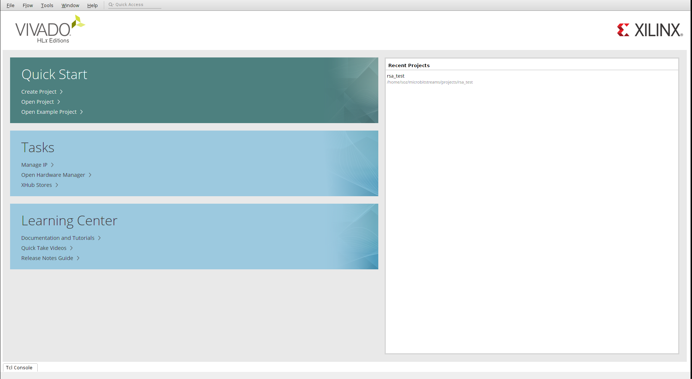
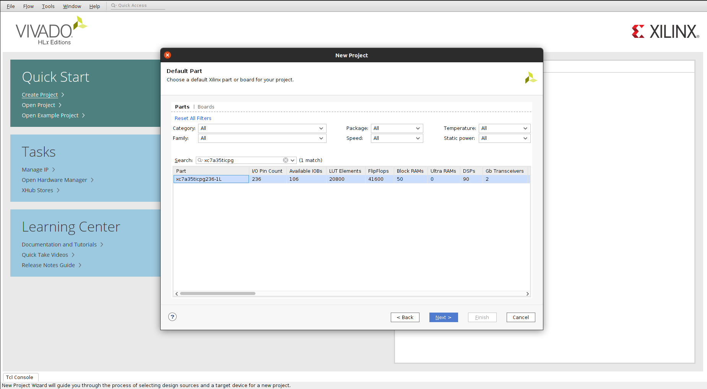
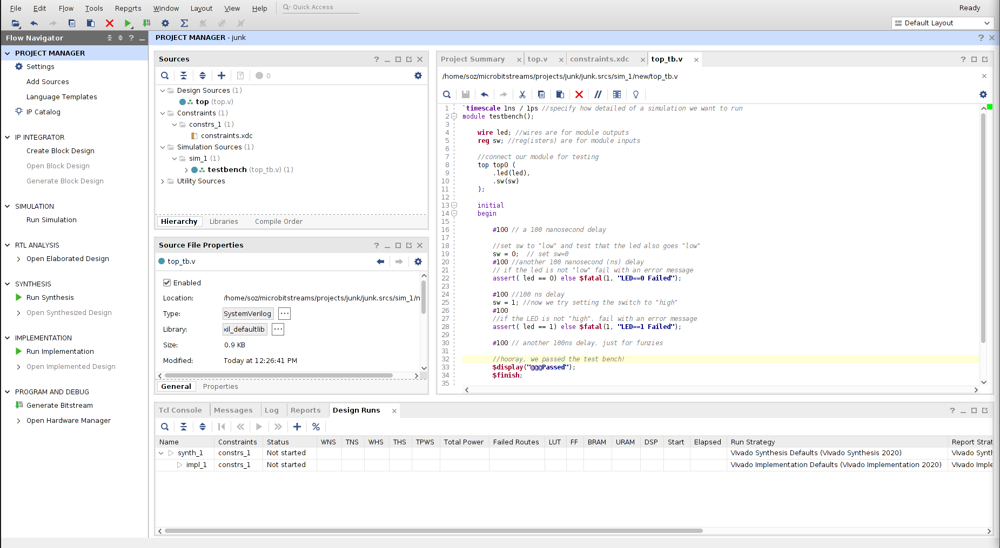
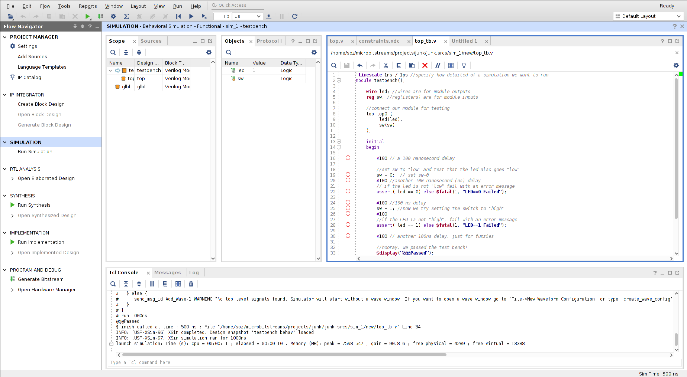
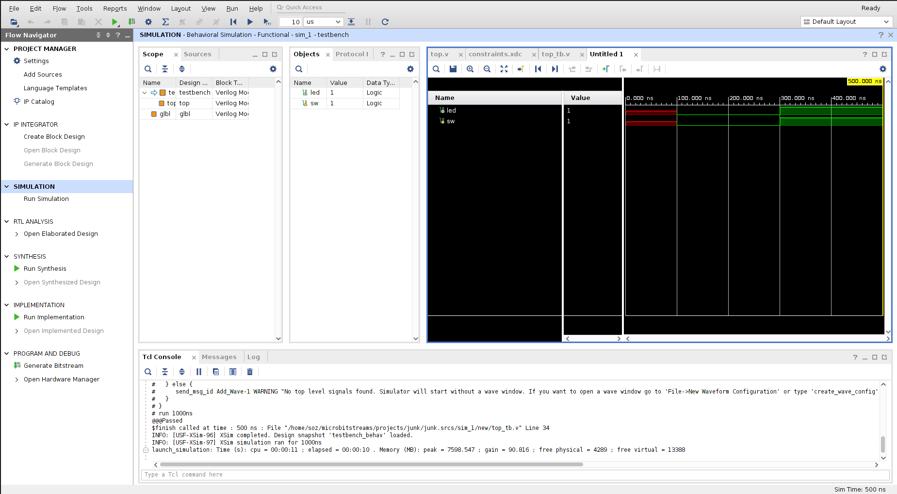
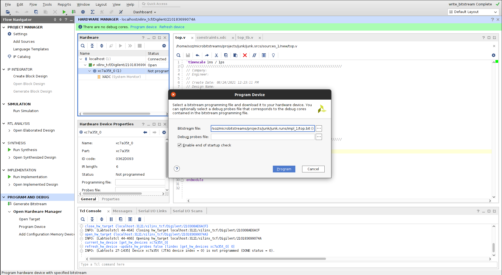

# Project 0: Vivado and Basys3 Tutorial

### E210/B441, Spring 2020 Version: 2020.

## NOTE: This project has been depreciated.

## Description

This tutorial shows the steps in a digital design project using Xilinx Vivado design suite and Digilent 
Basys 3 FPGA board. You will learn how to use Vivado tool to create a digital design and implement the 
design on an FPGA circuit located on the Basys board.

Here you will design and implement a circuit which consists of a slide switch and a light
emitting diode (LED). If the slide switch is up, the LED will light up (will be turned on). If
the slide switch is down, the LED will turn off.

This is a starter project with very little hands-on work, but it is a good reference if you
ever forget how to start and complete a lab project.

## Create a project

- Start Vivado and create a new project.

- Follow the wizard. Browse and select a folder in which your project will be created.
- Give a name to your project, for example Project0.
- Check "Create project subdirectory."
- For Project Type, select "RTL Project."
- You do not need to add any sources at this time.
- You do not need to add any constraints at this time.

### Default Part
- Search for part <i>"xc7a35ticpg236-1L."</i>


- Now click 'Finish'
- Your screen should look like this:

## Create Design Source File

Now we will add our first Verilog source file

- Right click on "Add Sources" on the left side window.
- Check "Add or create design sources", then "Next."
- Click "+" on the left hand menu, and select "Create file." In the dialog box enter the name of the file, to make it easier, give it the name <b>"top.v"</b> This will be our 'top'-level 'verilog' file.
- <b>Select 'System Verilog' from the 'File type' Menu.</b> The "System" Verilog extension lets us for modern Verilog features. We will discuss this more later in the class. If you forget to do this, you can modify the File type later through the ‘properties’ menu.
- Click "Finish."
- It should look something like this:

- If you get a "Define Module" prompt, just click "OK".
- File "top.v" is now in Design Sources under the Project Manager Window.

- Double click on <i>"top.v"</i> is the Design Sources.
- Enter the following Verilog statements:

```verilog
module top(
    input sw,
    output led
);
assign led = sw;

endmodule
```

- This says I have one output signal, led, and one input signal, sw. The assign statement just tells the FPGA to make the output signal match the input signal.
- When you are done it should look something like this:

- Save the file (Ctrl^S)

## Create Constraints File

Now we will add our first constraints source file. This tells Vivado how the inputs and outputs of
the top-level verilog file map to the real inputs and outputs of the Basys3 board.

- Click on <i>"Add Sources."</i>
- Select <i>"Add or create constraints"</i>
- Click `+` on the left hand menu, and select <i>"Create file."</i> In the dialog box enter the name of the file, to make it easier, give it a name <i>"<b>constraints.xdc</b>"</i>
- Click <i>"Finish"</i>
- File <i>"constraints.xdc"</i> is now in <i>Constraints -> constrs_1</i> under the Project Manager Window.
- Double click on <i>"constraints.xdc"</i>
- Enter the following statements:

```
set_property PACKAGE_PIN V17 [get_ports {sw}]
set_property IOSTANDARD LVCMOS33 [get_ports {sw}]
set_property PACKAGE_PIN U16 [get_ports {led}]
set_property IOSTANDARD LVCMOS33 [get_ports {led}]
```

- This tells Vivado which pins (or `PACKAGE_PIN`) you want your verilog signals `sw` and `led` to map to. A complete listing of what each pin does will be provided for you.
- Save the file (`Ctrl^S`)

## Create Simulation File (AKA a ‘testbench’)

We are now going to run a simulation to ensure that our verilog code is correct.

- Right click "Add Sources."
- Select "Add or create simulation sources" hit Next.
- Click `+` on the left hand menu, and select "Create file." In the dialog box enter the name of the file, to make it easier give it a name "top_tb.v". <ins>Select "System Verilog" from the "File Type" drop-down menu</ins>. This will be our "top" level testbench. The `"tb"` is shorthand for "test bench".
- Click "Finish."
- Again, if you get a Module popup, just click OK.
- File "top_tb.v" is in Simulation Sources -> sim_1.
- Note that "top.v" is also in Simulation Sources -> sim_1. This is normal.
- Double click on <i>"top_tb.v"</i>.
- Enter the following Verilog statements into top_tb.v:
- (please copy + paste this code, don’t try to rewrite it)

```verilog
`timescale 1ns / 1ps //specify how detailed of a simulation we want to run
module testbench();

    wire led; //wires are for module outputs
    reg sw; //reg(isters) are for module inputs

    //connect our module for testing

    top top0 (
        .led(led),
        .sw(sw)
    );

    initial
    begin
    #100 // a 100 nanosecond delay
    //set sw to "low" and test that the led also goes "low"
    sw = 0; // set sw=
    #100 //another 100 nanosecond (ns) delay
    // if the led is not "low" fail with an error message
    assert( led == 0) else $fatal(1, "LED==0 Failed");
    #100 //100 ns delay
    sw = 1; //now we try setting the switch to “high”
    #100
    //if the LED is not “high”, fail with an error message
    assert( led == 1) else $fatal(1, "LED==1 Failed");
    #100 // another 100ns delay, just for funzies
    //hooray, we passed the test bench!

    $display("@@@Passed");
    $finish;
    end

endmodule
```

- Save the file (Ctrl^S)

### Checkpoint

Now we should have all of our source files. Your setup should look like the following:


## Running a Simulation

Now we are going to run our simulation, and observe the outcomes of our testing.

- On the left hand menu select <i>"SIMULATION" -> "Run Simulation"</i>, then "Run Behavioral Simulation."
- This will take a few seconds
- When it is finished, you should get a window that looks something like this:

- Note the `@@@Passed` in the bottom window. This means our simulation, well, passed.
- Now let’s try to understand <i>why</i> it passed.
- Right click on `'led'` in the Objects Window and select 'Add to Wave Window'.
- You should now have a black window with red and green lines on the right-hand side of Vivado. It should look something like this:

- Repeat the process for sw. Right-click and “Add to Wave Window”
- Now in our the “Untitled” wave window on the right, you can view the waveform
- Waveforms allow us to observe the signals changing through time
- Time moves from left to right, we start at `0ns`, and move to `500ns`.
- Red lines means that the simulation doesn’t know the value for a signal. Before `100ns`, we haven’t assigned `sw` to anything, so the simulation doesn’t have a value for it. Because the simulation doesn’t know the value for the input `sw`, it can’t figure out the value for the output `led`.
- At `100ns`, everything changes to green. This is because we used
```verilog
sw = 0; // set sw=
```
in our simulation file. We told the simulation to set `sw` to `0`, so now it knows its value.
Once the simulation knew the value for `sw`, it could calculate the value for `led`, because
we told it
```verilog
assign led = sw;
```
in our source file.

- At `300ns`, we change the value of `sw`, and the value of `led` changes correspondingly.
- Waveform simulations are a great way to visualize and understand what is happening when problems arise. We will use them frequently in this class. The autograder uses a command-line version of these same simulations for its tests.


## Hardware Synthesis

- Now that we’re (mostly) sure our logic is correct, we can move on to "Synthesis" and programming the FPGA.
- On the left hand menu select "`SYNTHESIS`" -> <i>"Run Synthesis."</i> If prompted where to launch runs, select "Launch runs on local host". This tells Vivado to run synthesis on your local machine.
- Even for simple designs, synthesis takes a surprisingly long time. For industrial designs, it can take days. This process translates our verilog code into `LUTs`, or “Look-Up Tables”. It can also translate our code into basic logic gates. We’ll discuss this later in class.
- After the Synthesis is complete, select <i>"Run Implementation"</i>. This is also called "Auto Place and Route". This process decides which locations within the FPGA to use for each `LUT`, and how best to connect then.
- After the Implementation is complete, select <i>"Generate Bitstream"</i>. This generates a configuration file that is read by the `FPGA` when it boots up to decide how to configure itself.
- After the Generate Bitstream is complete, select "Open Hardware Manager".

## Programming the FPGA

This process will (finally) program the FPGA.

- If you haven't already, make sure your Basys3 board is connected
-  On the right-hand side, select "Programming and Debug" -> "Open Hardware Manager" -> "Open Target" -> "Autoconnect"
- This should automatically detect the Basys
- Now select "Programming and Debug" -> "Open Hardware Manager" -> "Program Device" -> 'xc7a35t_0'. (Your device might be named differently)
- You will need to select your 'bitstream' file. Xilinx did not make this easy. The bitstream is located at './project_0.runs/impl_1/top.bit' within your project. See the example below:

- With the bitstream selected, hit “program”. This should only take a few seconds.

## Testing your FPGA

You should now be able to test your FPGA. When you flip the right-most switch, the
corresponding LED should also toggle.


This concludes the Vivado tutorial lab.


