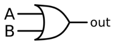
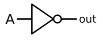
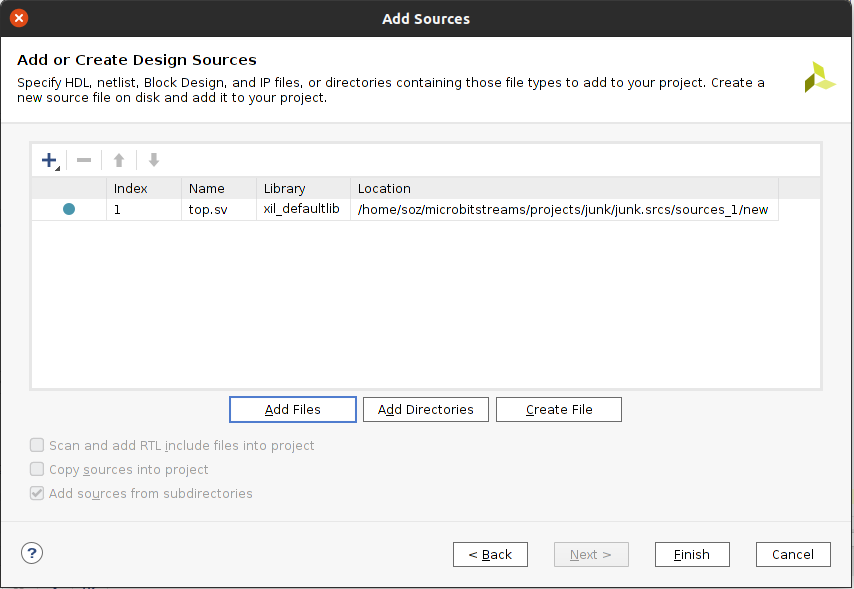
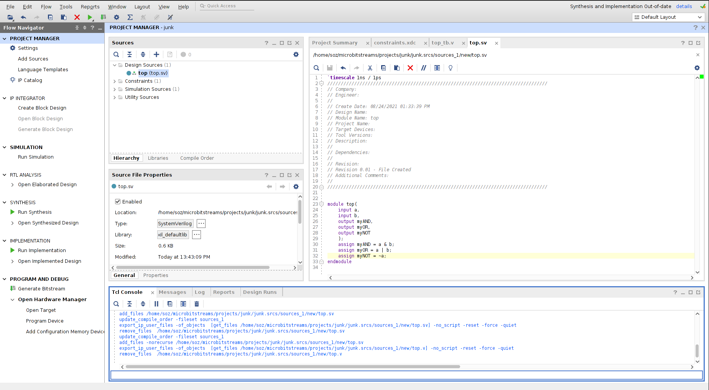
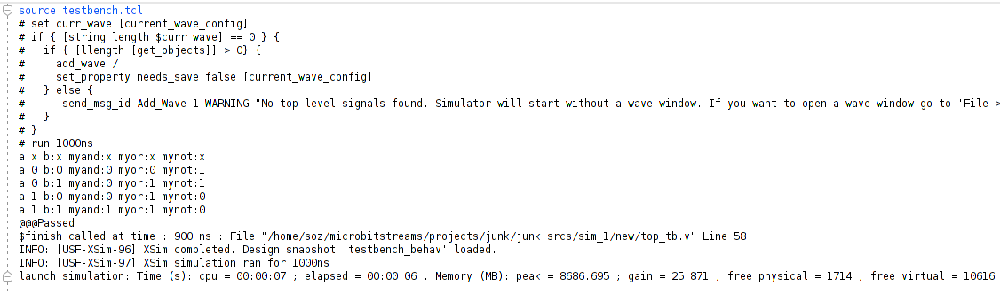
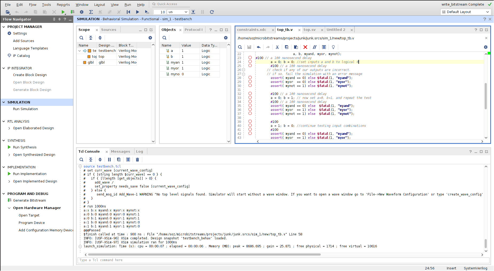
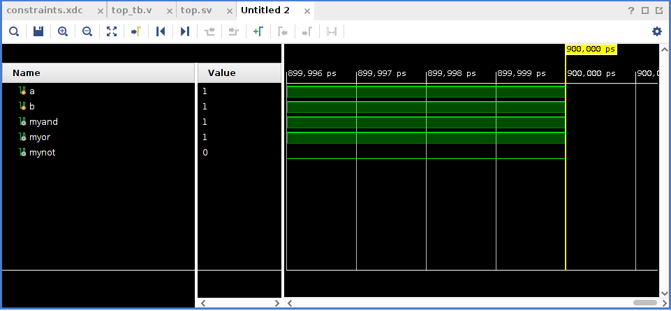
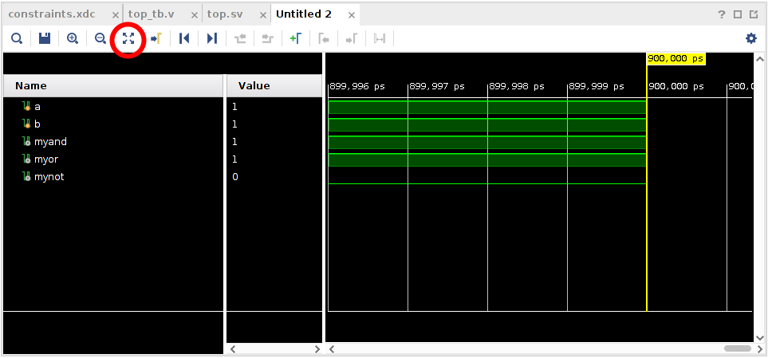
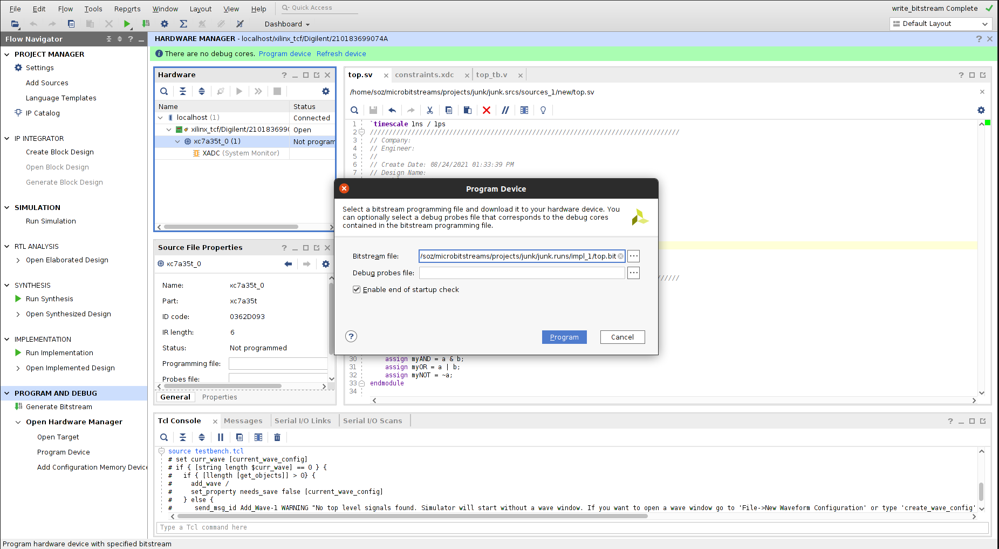

# Project 0: Logic Gates

<link rel="stylesheet" href="style.css">

## Table of Contents
1. [Overview](#overview)
2. [Background](#background)
    - [AND Gate](#and-gate)
    - [OR Gate](#or-gate)
    - [NOT Gate](#not-gate)
3. [Launching Vivado](#launching-vivado)
4. [Creating a Vivado Project](#creating-a-vivado-project)
5. [Creating a Design Source File](#creating-a-design-source-file)
6. [Creating a Constraints File](#creating-a-constraints-file)
7. [Create Simulation File](#create-simulation-file)
8. [Project Checkpoint](#project-checkpoint)
9. [Running a Simulation](#running-a-simulation)
10. [Autograder Submission](#autograder-submission)
11. [Hardware Synthesis](#hardware-synthesis)
12. [Programming the FPGA](#programming-the-fpga)
13. [Testing your FPGA](#testing-your-fpga)


### Board/Part Number
<div id="partNum">
XC7A35T-1CPG236C
</div>

### RDT&E Machines
<div id="blk">
The solution is to put your Vivado Project folder in the "CraneDev" directory. Vivado will not work correctly if your working files are not in the "CraneDev" directory.
</div>

## Overview <a name="overview"></a>

<div id="blk">
This tutorial shows the steps in a digital design project using Xilinx Vivado design suite and
Digilent Basys 3 FPGA board. You will learn how to use Vivado tools to create a design and
implement it on the Basys3's FPGA. This is a starter project with very little hands-on work, but it
is a good reference if you ever forget how to start and complete a lab project.

Logic gates are the foundation of all computer systems. They allow for the application of logical
processing to be mapped onto physical circuits. In this lab project you will design and implement
a digital system that uses three basic logic gates: the AND gate, the OR gate, and the NOT
gate. The logic schematic of the digital system is given below.
</div>


<div id="blk">
If you need help you can contact Christopher Sozio through email: christopher.sozio@navy.mil
</div>

## Background <a name="background"></a>

### AND Gate <a name="and-gate"></a>

<div id="blk">
The truth table for a 2-input AND gate is:
</div>

| A | B | Out |
| ----------- | ----------- | ----------- |
| 0 | 0 | 0 |
| 0 | 1 | 0 | 
| 1 | 0 | 0 | 
| 1 | 1 | 1 |

<div id="blk">
And is denoted by the following schematic symbol:
</div>


<div id="blk">
The verilog keyword is: <b>&</b>
</div>

### OR Gate <a name="or-gate"></a>

<div id="blk">
The truth table for a 2 input OR gate is:
</div>

| A | B | Out |
| ----------- | ----------- | ----------- |
| 0 | 0 | 0 |
| 0 | 1 | 1 | 
| 1 | 0 | 1 | 
| 1 | 1 | 1 |

<div id="blk">
And is denoted by the following schematic symbol:
</div>



<div id="blk">
The verilog keyword is: <b>|</b>
</div>

### NOT Gate <a name="not-gate"></a>

<div id="blk">
The truth table for a 1-input NOT gate is:
</div>

| A | Out |
| ----------- | ----------- |
| 0 | 1 |
| 1 | 0 |

<div id="blk">
And is denoted by the following schematic symbol:
</div>



<div id="blk">
The verilog keyword is: <b>~</b>
</div>

<!-- ## Launching Vivado <a name="launching-vivado"></a>

<div id="blk">
To launch Vivado, you will need to be logged into one of the Luddy Linux Machines. These are
available in 4111 IF(Luddy).
</div>

<div id="blk">
Remote users are encouraged to follow the tutorial here:
</div>

[Running Graphical Programs Remotely](https://uisapp2.iu.edu/confluence-prd/pages/viewpage.action?pageId=280461906)

<div id="blk">
To launch Vivado, you should only need to type 'vivado' into the command line:
</div>

 -->

## Creating a Vivado Project <a name="creating-a-vivado-project"></a>

<div id="blk">
    <ul>
        <li> Start Vivado and create a new project.
    </ul>
</div>


<div id="blk">
- Follow the wizard. Browse and select a folder in which your project will be created.
- Give a name to your project, for example `Project1`.
- Check "Create project subdirectory."
- For Project Type, select "`RTL Project.`"
- You do not need to add any sources at this time.
- You do not need to add any constraints at this time.
- Search for part <i>"xc7a35ticpg236-1L."</i>
</div>


<div id="blk">
- Now click 'Finish'
- Your screen should look like this:
</div>


## Creating a Design Source File <a name="creating-a-design-source-file"></a>

<div id="blk">
Now we will add our first SystemVerilog source file
</div>

<div id="blk">
- Right click on "`Add Sources`" on the left side window.
- Check "`Add` or create design sources", then "Next."
- Click "`+`" on the left hand menu, and select "`Create` file." In the dialog box enter the name of the file, to make it easier, give it the name "<b>top.sv</b>" This will be our 'top'-level 'verilog' file.
- <b>Select 'System Verilog' from the 'File type' Menu.</b> The "System" Verilog extension lets us use modern Verilog features. We will discuss this more later in the class. If you forget to do this, you can modify the File type later through the 'properties' menu.
- Click "`Finish`."
- It should look something like this:
</div>



<div id="blk">
- If you get a "`Define Module`" prompt, just click "`OK`".
- File "`top.sv`" is now in `Design Sources` under the `Project Manager Window`.
</div>


<div id="blk">
- Double click on <i>"top.sv"</i> is the <i>Design Sources</i>.
- Enter the following `Verilog` statements:
</div>

```verilog
module top (
input a,
input b,
output myAND,
output myOR,
output myNOT
);
assign myAND = a & b;
assign myOR = a | b;
assign myNOT = ~a;
endmodule
```

<div id="blk">
- This `code` has two inputs (a and b) and three outputs (`myAND`, `myOR`, and `myNOT`). The `assign` statements tell the `FPGA` how to map the output signals given the input signals. In this `case`, we are using boolean logic operations (`&`, `|`, and `~`) to compute the `logical and, or,` and `not` of the input signals.
- When you are done it should look something like this:
</div>



<div id="blk">
- Save the file (`Ctrl^S`)
</div>

## Creating a Constraints File <a name="creating-a-constraints-file"></a>

<div id="blk">
Now we will add our first constraints source file. This tells Vivado how the inputs and outputs of
the verilog code map to the real inputs and outputs of the Basys3 board.
</div>

| Verilog Signal | Basys switch/LED |
| ----------- | ----------- |
| a | sw |
| b | sw |
| myAND | led |
| myNOT | led |
| myOR | led |

<div id="blk">
- Click on <i>"Add Sources."</i>
- Select <i>"Add or create constraints"</i>
- Click `+` on the left hand menu, and select <i>"Create file."</i> In the dialog box enter the name of the file, to make it easier, give it a name <i><b>"constraints.xdc"</b></i>
- Click <i>"Finish"</i>
- File <i>"constraints.xdc"</i> is now in <i>Constraints -> constrs_1</i> under the `Project Manager Window`.
- Double click on <i>"constraints.xdc"</i>
- Enter the following statements:
</div>

```
set_property PACKAGE_PIN V17 [get_ports {a}]
    set_property IOSTANDARD LVCMOS33 [get_ports {a}]
set_property PACKAGE_PIN V16 [get_ports {b}]
    set_property IOSTANDARD LVCMOS33 [get_ports {b}]
set_property PACKAGE_PIN U16 [get_ports {myAND}]
    set_property IOSTANDARD LVCMOS33 [get_ports {myAND}]
set_property PACKAGE_PIN E19 [get_ports {myOR}]
    set_property IOSTANDARD LVCMOS33 [get_ports {myOR}]
set_property PACKAGE_PIN U19 [get_ports {myNOT}]
    set_property IOSTANDARD LVCMOS33 [get_ports {myNOT}]
```

<div id="blk">
- This tells Vivado which physical pins (or `PACKAGE_PIN`) you want your verilog signals to map to. A complete listing of what each pin does will be provided for you.
- Save the file (`Ctrl^S`)
</div>

<div id="blk">
Later in the semester, we will make use of the `"Basys3_Master.xdc"` constraints file uploaded
on the website. It can be found under the `Downloads` quick link.
</div>

## Create Simulation File (AKA a 'testbench') <a name="create-a-simulation-file"></a>

<div id="blk">
We are now going to run a simulation to ensure that our verilog code is correct.
</div>

<div id="blk">
- Right click "Add Sources."
- Select "Add or create simulation sources" hit `Next`.
- Click `+` on the left hand menu, and select "Create file." In the dialog box enter the name of the file, to make it easier give it a name "top_tb.sv". <ins>Select "System Verilog" from the "File Type" drop-down menu</ins>. This will be our "top" level testbench. The "tb" is shorthand for "test bench".
- Click "`Finish`."
- Again, if you get a Module popup, just click `OK`.
- File "top_tb.sv" is in Simulation Sources -> sim_1.
- Note that "top.sv" is also in Simulation Sources -> sim_1. This is normal.
- Double click on <i>"top_tb.sv"</i>.
- Enter the following Verilog statements into top_tb.sv:
- (please copy + paste this code, don't try to rewrite it)
</div>

```verilog
`timescale 1ns/1ps //specify how detailed of a simulation we want to run
module testbench();
    logic a, b; //logic (or 'reg') for module inputs
    wire myand, myor, mynot; //wires for module outputs
    //
    // connect our module for testing
    // This is sometimes called a DUT - Device Under Test
    //
    top top0 (
        .a(a),
        .b(b),
        .myAND(myand),
        .myOR(myor),
        .myNOT(mynot)
    );
    initial begin
        //print out these signals whenever anything changes
        $monitor("a:%h b:%h myand:%h myor:%h mynot:%h", a, b, myand, myor, mynot);

        #100 // a 100 nanosecond delay
        a = 0; b = 0; //set inputs a and b to logical 0
        #100 // a 100 nanosecond delay
        // check if any of our outputs are incorrect.
        // if so, fail the simulation with an error message
        assert( myand == 0) else $fatal(1, "myand");
        assert( myor == 0) else $fatal(1, "myor");
        assert( mynot == 1) else $fatal(1, "mynot");
        #100 // a 100 nanosecond delay
        a = 0; b = 1; // now set a=0, b=1, and repeat the test
        #100 // a 100 nanosecond delay
        assert( myand == 0) else $fatal(1, "myand");
        assert( myor == 1) else $fatal(1, "myor");
        assert( mynot == 1) else $fatal(1, "mynot");
        #100
        a = 1; b = 0; //continue testing input combinations
        #100
        assert( myand == 0) else $fatal(1, "myand");
        assert( myor == 1) else $fatal(1, "myor");
        assert( mynot == 0) else $fatal(1, "mynot");
        #100
        a = 1; b = 1; //last input combination
        #100
        assert( myand == 1) else $fatal(1, "myand");
        assert( myor == 1) else $fatal(1, "myor");
        assert( mynot == 0) else $fatal(1, "mynot");
        #100

        // now we've tested all possible input combinations to
        // ensure correct output for each
        $display("@@@Passed");
        $finish;
    end
endmodule
```

<div id="blk">
- Save the file (`Ctrl^S`)
</div>

## Project Checkpoint <a name="project-checkpoint"></a>

<div id="blk">
Now we should have all of our source files. Your setup should look like the following:
</div>


## Running a Simulation <a name="running-a-simulation"></a>

<div id="blk">
Now we are going to run our simulation, and use the testbench to drive inputs and observe the
outputs of our verilog module.
</div>

<div id="blk">
- On the left hand menu select <i>"SIMULATION" -> "Run Simulation"</i>, then "Run Behavioral Simulation."
- This will take a few seconds
- When it is finished, you should get a window that looks something like this in the bottom window. Note the `@@@Passed`. This means our simulation, well, passed.
</div>



<div id="blk">
- Now let's try to understand <i>why</i> it passed. For that, we need to look at the "Wave Window". Vivado automatically created one for you (circled below). Click on it.
</div>



<div id="blk">
- It should look something like this:
</div>



<div id="blk">
- Now click on the  button:
</div>



<div id="blk">
- Now your wave window should display the entire <b>waveform</b>. Waveforms allow us to observe how signals change through time. Time moves from left to right, it starts at `0ns` (nanoseconds), and moves to `900ns`.
</div>


<div id="blk">
- The simulator looks for an initial block to run the simulations.
</div>

```verilog
initial begin
```

<div id="blk">
- It starts at `0ns`, but everything is red. Red lines means that the simulation doesn't know the value for a signal. Before `100ns`, we haven't assigned `a` or `b` to anything, so the simulation doesn't have a value for them. Because the simulation doesn't know the value for the inputs, it can't figure out the value for the outputs `myAND, myOR,` and `myNOT`.

- At `100ns`, everything changes to green. This is because we used
</div>
```verilog
#100 // a 100 nanosecond delay
a = 0; b = 0; //set inputs a and b to logical 0
```

<div id="blk">
in our simulation file. We told the simulation to set a and b to 0, so now it knows their
values. Once the simulation knew the value for a and b, it could calculate the value for
myAND, because we told it
</div>

```verilog
assign myAND = a & b;
```

<div id="blk">
in our source file.
</div>

<div id="blk">
- FPGAs require a small amount of time to update an output signal given changes in the input. Therefore, we need another `#100` delay before the updates in `a` and `b` show up in the outputs.

- At `200ns`, we test the values of `myAND, myOR,` and `myNOT` to make sure they are correct. Assert statements test a boolean equation `(myand == 0)` and does nothing if it is `true`. If it is `false`, it will terminate the simulation and report an error (`$fatal(1, "myand")`).
</div>

```verilog
assert( myand == 0) else $fatal(1, "myand");
assert( myor == 0) else $fatal(1, "myor");
assert( mynot == 1) else $fatal(1, "mynot");
```
<div id="blk">
- This process repeats for every possible combination of `a` and `b`.

- Waveform simulations are a great way to visualize and understand what is happening when problems arise. We will use them frequently in this class. The autograder uses a command-line version of these same simulations for its tests.
</div>

## Autograder Submission <a name="autograder-submission"></a>

<div id="blk">
Submit to me (Chris Sozio) if you would like. Email: christopher.sozio@navy.mil
</div>

## Hardware Synthesis <a name="hardware-synthesis"></a>

<div id="blk">
- Now that we're (mostly) sure our logic is correct, we can move on to "Synthesis". Synthesis is roughly equivalent to "Compiling" for FPGAs.
- On the left hand menu select "`SYNTHESIS`" -> <i>"Run Synthesis."</i> If prompted where to launch runs, select "Launch runs on local host'. This tells Vivado to run synthesis on your local machine.
- Even for simple designs, synthesis takes a surprisingly long time, usually 1-2 minutes. For large industrial designs, it can take days. This process translates our verilog code into `LUTs`, or "Look-Up Tables". It can also translate our code into basic logic gates. We'll discuss this later in class.
- After the Synthesis is complete, select <i>"Run Implementation"</i>. This is also called "`Auto Place and Route`". This process decides which locations within the `FPGA` to use for each `LUT`, and how best to connect then.
- After the Implementation is complete, select <i>"Generate Bitstream"</i>. This generates a configuration file that is read by the `FPGA` when it boots up to decide how to configure itself.
- After the Generate Bitstream is complete, select "Open Hardware Manager".
</div>

## Programming the FPGA <a name="programming-the-fpga"></a>

<div id="blk">
 This process will (finally) program the FPGA.

- If you haven't already, <b>make sure your Basys3 board is connected</b>.
- On the right-hand side, select "Programming and Debug" -> "Open Hardware Manager" -> "Open Target" -> "Autoconnect"
- This should automatically detect the Basys
- Now select "Programming and Debug" -> "Open Hardware Manager" -> "Program Device" -> <board>'xc7a35t_0'</board>. (Your device might be named differently)
- You will need to select your 'bitstream' file. Xilinx did not make this easy. The bitstream is located at './project_0.runs/impl_1/top.bit' within your project. See the example below:
</div>



<div id="blk">
- With the bitstream selected, hit "program". This should only take a few seconds.
</div>

## Testing your FPGA <a name="testing-your-fpga"></a>

<div id="blk">
You should now be able to test your FPGA. When you flip the right-most switches, the
corresponding LEDs should also toggle.
</div>


<div id="blk">
This concludes the Vivado tutorial lab.
</div>


