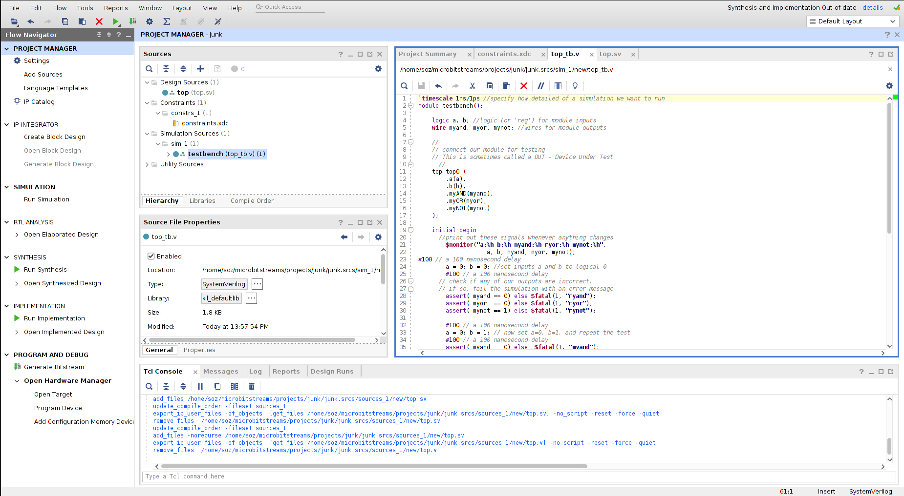

# Project 0: Logic Gates

## Table of Contents
1. [Overview](#overview)
2. [Background](#background)
    - [AND Gate](#and-gate)
    - [OR Gate](#or-gate)
    - [NOT Gate](#not-gate)
3. [Launching Vivado](#launching-vivado)
4. [Creating a Vivado Project](#creating-a-vivado-project)
5. [Creating a Design Source File](#creating-a-design-source-file)
6. [Creating a Constraints File](#creating-a-constraints-file)
7. [Create Simulation File](#create-simulation-file)
8. [Project Checkpoint](#project-checkpoint)
9. [Running a Simulation](#running-a-simulation)
10. [Autograder Submission](#autograder-submission)
11. [Hardware Synthesis](#hardware-synthesis)
12. [Programming the FPGA](#programming-the-fpga)
13. [Testing your FPGA](#testing-your-fpga)

### E210/B441, Spring 2021 Version 2021.0

### Due Date: None

## Overview <a name="overview"></a>

This tutorial shows the steps in a digital design project using Xilinx Vivado design suite and
Digilent Basys 3 FPGA board. You will learn how to use Vivado tools to create a design and
implement it on the Basys3's FPGA. This is a starter project with very little hands-on work, but it
is a good reference if you ever forget how to start and complete a lab project.

Logic gates are the foundation of all computer systems. They allow for the application of logical
processing to be mapped onto physical circuits. In this lab project you will design and implement
a digital system that uses three basic logic gates: the AND gate, the OR gate, and the NOT
gate. The logic schematic of the digital system is given below.


## Background <a name="background"></a>

### AND Gate <a name="and-gate"></a>

The truth table for a 2-input AND gate is:

| A | B | Out |
| ----------- | ----------- | ----------- |
| 0 | 0 | 0 |
| 0 | 1 | 0 | 
| 1 | 0 | 0 | 
| 1 | 1 | 1 |

And is denoted by the following schematic symbol:


The verilog keyword is: <b>&</b>

### OR Gate <a name="or-gate"></a>

The truth table for a 2 input OR gate is:

| A | B | Out |
| ----------- | ----------- | ----------- |
| 0 | 0 | 0 |
| 0 | 1 | 1 | 
| 1 | 0 | 1 | 
| 1 | 1 | 1 |

And is denoted by the following schematic symbol:


The verilog keyword is: <b>|</b>

### NOT Gate <a name="not-gate"></a>

The truth table for a 1-input NOT gate is:

| A | Out |
| ----------- | ----------- |
| 0 | 1 |
| 1 | 0 |

And is denoted by the following schematic symbol:


The verilog keyword is: <b>~</b>

## Launching Vivado <a name="launching-vivado"></a>

To launch Vivado, you will need to be logged into one of the Luddy Linux Machines. These are
available in 4111 IF(Luddy).

Remote users are encouraged to follow the tutorial here:

[Running Graphical Programs Remotely](https://uisapp2.iu.edu/confluence-prd/pages/viewpage.action?pageId=280461906)

To launch Vivado, you should only need to type 'vivado' into the command line:


## Creating a Vivado Project <a name="creating-a-vivado-project"></a>

- Start Vivado and create a new project.


- Follow the wizard. Browse and select a folder in which your project will be created.
- Give a name to your project, for example `Project1`.
- Check "Create project subdirectory."
- For Project Type, select "`RTL Project.`"
- You do not need to add any sources at this time.
- You do not need to add any constraints at this time.
- Search for part <i>"xc7a35ticpg236-1L."</i>


- Now click 'Finish'
- Your screen should look like this:


## Creating a Design Source File <a name="creating-a-design-source-file"></a>

Now we will add our first SystemVerilog source file

- Right click on "`Add Sources`" on the left side window.
- Check "`Add` or create design sources", then "Next."
- Click "`+`" on the left hand menu, and select "`Create` file." In the dialog box enter the name of the file, to make it easier, give it the name "<b>top.sv</b>" This will be our 'top'-level 'verilog' file.
- <b>Select 'System Verilog' from the 'File type' Menu.</b> The "System" Verilog extension lets us use modern Verilog features. We will discuss this more later in the class. If you forget to do this, you can modify the File type later through the 'properties' menu.
- Click "`Finish`."
- It should look something like this:


- If you get a "`Define Module`" prompt, just click "`OK`".
- File "`top.sv`" is now in `Design Sources` under the `Project Manager Window`.


- Double click on <i>"top.sv"</i> is the <i>Design Sources</i>.
- Enter the following `Verilog` statements:

```verilog
module top (
input a,
input b,
output myAND,
output myOR,
output myNOT
);
assign myAND = a & b;
assign myOR = a | b;
assign myNOT = ~a;
endmodule
```

- This `code` has two inputs (a and b) and three outputs (`myAND`, `myOR`, and `myNOT`). The `assign` statements tell the `FPGA` how to map the output signals given the input signals. In this `case`, we are using boolean logic operations (`&`, `|`, and `~`) to compute the `logical and, or,` and `not` of the input signals.
- When you are done it should look something like this:


- Save the file (`Ctrl^S`)

## Creating a Constraints File <a name="creating-a-constraints-file"></a>

Now we will add our first constraints source file. This tells Vivado how the inputs and outputs of
the verilog code map to the real inputs and outputs of the Basys3 board.

| Verilog Signal | Basys switch/LED |
| ----------- | ----------- |
| a | sw |
| b | sw |
| myAND | led |
| myNOT | led |
| myOR | led |

- Click on <i>"Add Sources."</i>
- Select <i>"Add or create constraints"</i>
- Click `+` on the left hand menu, and select <i>"Create file."</i> In the dialog box enter the name of the file, to make it easier, give it a name <i><b>"constraints.xdc"</b></i>
- Click <i>"Finish"</i>
- File <i>"constraints.xdc"</i> is now in <i>Constraints -> constrs_1</i> under the `Project Manager Window`.
- Double click on <i>"constraints.xdc"</i>
- Enter the following statements:

```
set_property PACKAGE_PIN V17 [get_ports {a}]
    set_property IOSTANDARD LVCMOS33 [get_ports {a}]
set_property PACKAGE_PIN V16 [get_ports {b}]
    set_property IOSTANDARD LVCMOS33 [get_ports {b}]
set_property PACKAGE_PIN U16 [get_ports {myAND}]
    set_property IOSTANDARD LVCMOS33 [get_ports {myAND}]
set_property PACKAGE_PIN E19 [get_ports {myOR}]
    set_property IOSTANDARD LVCMOS33 [get_ports {myOR}]
set_property PACKAGE_PIN U19 [get_ports {myNOT}]
    set_property IOSTANDARD LVCMOS33 [get_ports {myNOT}]
```

- This tells Vivado which physical pins (or `PACKAGE_PIN`) you want your verilog signals to map to. A complete listing of what each pin does will be provided for you.
- Save the file (`Ctrl^S`)

Later in the semester, we will make use of the `"Basys3_Master.xdc"` constraints file uploaded
on the website. It can be found under the `Downloads` quick link.

## Create Simulation File (AKA a 'testbench') <a name="create-a-simulation-file"></a>

We are now going to run a simulation to ensure that our verilog code is correct.

- Right click "Add Sources."
- Select "Add or create simulation sources" hit `Next`.
- Click `+` on the left hand menu, and select "Create file." In the dialog box enter the name of the file, to make it easier give it a name "top_tb.sv". <ins>Select "System Verilog" from the "File Type" drop-down menu</ins>. This will be our "top" level testbench. The "tb" is shorthand for "test bench".
- Click "`Finish`."
- Again, if you get a Module popup, just click `OK`.
- File "top_tb.sv" is in Simulation Sources -> sim_1.
- Note that "top.sv" is also in Simulation Sources -> sim_1. This is normal.
- Double click on <i>"top_tb.sv"</i>.
- Enter the following Verilog statements into top_tb.sv:
- (please copy + paste this code, don't try to rewrite it)

```verilog
`timescale 1ns/1ps //specify how detailed of a simulation we want to run
module testbench();
    logic a, b; //logic (or 'reg') for module inputs
    wire myand, myor, mynot; //wires for module outputs
    //
    // connect our module for testing
    // This is sometimes called a DUT - Device Under Test
    //
    top top0 (
        .a(a),
        .b(b),
        .myAND(myand),
        .myOR(myor),
        .myNOT(mynot)
    );
    initial begin
        //print out these signals whenever anything changes
        $monitor("a:%h b:%h myand:%h myor:%h mynot:%h", a, b, myand, myor, mynot);

        #100 // a 100 nanosecond delay
        a = 0; b = 0; //set inputs a and b to logical 0
        #100 // a 100 nanosecond delay
        // check if any of our outputs are incorrect.
        // if so, fail the simulation with an error message
        assert( myand == 0) else $fatal(1, "myand");
        assert( myor == 0) else $fatal(1, "myor");
        assert( mynot == 1) else $fatal(1, "mynot");
        #100 // a 100 nanosecond delay
        a = 0; b = 1; // now set a=0, b=1, and repeat the test
        #100 // a 100 nanosecond delay
        assert( myand == 0) else $fatal(1, "myand");
        assert( myor == 1) else $fatal(1, "myor");
        assert( mynot == 1) else $fatal(1, "mynot");
        #100
        a = 1; b = 0; //continue testing input combinations
        #100
        assert( myand == 0) else $fatal(1, "myand");
        assert( myor == 1) else $fatal(1, "myor");
        assert( mynot == 0) else $fatal(1, "mynot");
        #100
        a = 1; b = 1; //last input combination
        #100
        assert( myand == 1) else $fatal(1, "myand");
        assert( myor == 1) else $fatal(1, "myor");
        assert( mynot == 0) else $fatal(1, "mynot");
        #100

        // now we've tested all possible input combinations to
        // ensure correct output for each
        $display("@@@Passed");
        $finish;
    end
endmodule
```

- Save the file (`Ctrl^S`)

## Project Checkpoint <a name="project-checkpoint"></a>

Now we should have all of our source files. Your setup should look like the following:



## Running a Simulation <a name="running-a-simulation"></a>

Now we are going to run our simulation, and use the testbench to drive inputs and observe the
outputs of our verilog module.

- On the left hand menu select <i>"SIMULATION" -> "Run Simulation"</i>, then "Run Behavioral Simulation."
- This will take a few seconds
- When it is finished, you should get a window that looks something like this in the bottom window. Note the `@@@Passed`. This means our simulation, well, passed.


- Now let's try to understand <i>why</i> it passed. For that, we need to look at the "Wave Window". Vivado automatically created one for you (circled below). Click on it.


- It should look something like this:


- Now click on the  button:


- Now your wave window should display the entire <b>waveform</b>. Waveforms allow us to observe how signals change through time. Time moves from left to right, it starts at `0ns` (nanoseconds), and moves to `900ns`.


- The simulator looks for an initial block to run the simulations.

```verilog
initial begin
```

- It starts at `0ns`, but everything is red. Red lines means that the simulation doesn't know the value for a signal. Before `100ns`, we haven't assigned `a` or `b` to anything, so the simulation doesn't have a value for them. Because the simulation doesn't know the value for the inputs, it can't figure out the value for the outputs `myAND, myOR,` and `myNOT`.

- At `100ns`, everything changes to green. This is because we used
```verilog
#100 // a 100 nanosecond delay
a = 0; b = 0; //set inputs a and b to logical 0
```
in our simulation file. We told the simulation to set a and b to 0, so now it knows their
values. Once the simulation knew the value for a and b, it could calculate the value for
myAND, because we told it
```verilog
assign myAND = a & b;
```
in our source file.

- FPGAs require a small amount of time to update an output signal given changes in the input. Therefore, we need another `#100` delay before the updates in `a` and `b` show up in the outputs.

- At `200ns`, we test the values of `myAND, myOR,` and `myNOT` to make sure they are correct. Assert statements test a boolean equation `(myand == 0)` and does nothing if it is `true`. If it is `false`, it will terminate the simulation and report an error (`$fatal(1, "myand")`).

```verilog
assert( myand == 0) else $fatal(1, "myand");
assert( myor == 0) else $fatal(1, "myor");
assert( mynot == 1) else $fatal(1, "mynot");
```
- This process repeats for every possible combination of `a` and `b`.

- Waveform simulations are a great way to visualize and understand what is happening when problems arise. We will use them frequently in this class. The autograder uses a command-line version of these same simulations for its tests.

## Autograder Submission <a name="autograder-submission"></a>

 We'll be using an automatic testbench and grading system (Autograder) for the Verilog in this
 course. It will help you debug your code and give you live feedback on your current score for
 the project. Although this project is ungraded, we recommend you test out the autograder to
 make sure it works.

- Using a web-browser, log on to: [Autograder](https://autograder.sice.indiana.edu.)

- <b>Log in using your 'email@iu.edu' Google Account.</b>
- Select the "`Engr 210 Sping 2021`" class
- Select "`P0`" from the Projects list
- You should now be at a page that looks something like this:


- Drag (or upload) both your top.sv and top_tb.sv files into the "submissions" window. <ins>These files can often be found under the "project_1.srcs" subfolder within Vivado.</ins>
- Click submit.
- You should now be taken to the 'My Submissions' window, where the results of your submissions will be shown shortly. It should look something like this:


- This page will display the `score` for both the modules that will be used for the `FPGA` (`top.sv`) and also the testbench modules that are used to test the code (`top_tb.sv`).

## Hardware Synthesis <a name="hardware-synthesis"></a>

- Now that we're (mostly) sure our logic is correct, we can move on to "Synthesis". Synthesis is roughly equivalent to "Compiling" for FPGAs.
- On the left hand menu select "`SYNTHESIS`" -> <i>"Run Synthesis."</i> If prompted where to launch runs, select "Launch runs on local host'. This tells Vivado to run synthesis on your local machine.
- Even for simple designs, synthesis takes a surprisingly long time, usually 1-2 minutes. For large industrial designs, it can take days. This process translates our verilog code into `LUTs`, or "Look-Up Tables". It can also translate our code into basic logic gates. We'll discuss this later in class.
- After the Synthesis is complete, select <i>"Run Implementation"</i>. This is also called "`Auto Place and Route`". This process decides which locations within the `FPGA` to use for each `LUT`, and how best to connect then.
- After the Implementation is complete, select <i>"Generate Bitstream"</i>. This generates a configuration file that is read by the `FPGA` when it boots up to decide how to configure itself.
- After the Generate Bitstream is complete, select "Open Hardware Manager".

## Programming the FPGA <a name="programming-the-fpga"></a>

 This process will (finally) program the FPGA.

- If you haven't already, <b>make sure your Basys3 board is connected</b>.
- On the right-hand side, select "Programming and Debug" -> "Open Hardware Manager" -> "Open Target" -> "Autoconnect"
- This should automatically detect the Basys
- Now select "Programming and Debug" -> "Open Hardware Manager" -> "Program Device" -> <part>'xc7a35t_0'</part>. (Your device might be named differently)
- You will need to select your 'bitstream' file. Xilinx did not make this easy. The bitstream is located at './project_0.runs/impl_1/top.bit' within your project. See the example below:


- With the bitstream selected, hit "program". This should only take a few seconds.

## Testing your FPGA <a name="testing-your-fpga"></a>

 You should now be able to test your FPGA. When you flip the right-most switches, the
 corresponding LEDs should also toggle.


 This concludes the Vivado tutorial lab.


<style>
part {
    color:red;
}
</style>
