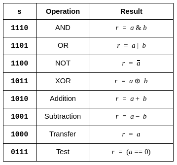
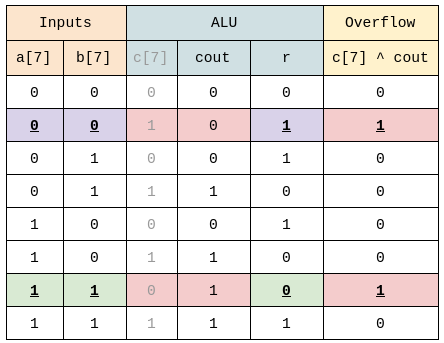
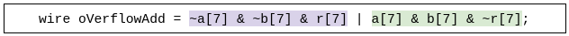
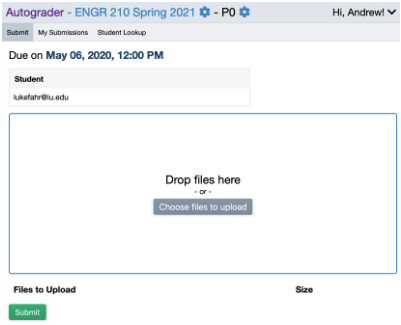
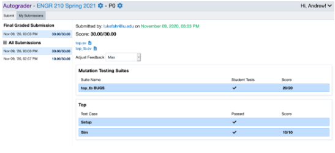

# Project 2: Arithmetic Logic Unit

<link rel="stylesheet" href="style.css">

## Table of Contents
1. [Overview](#overview)
2. [Background](#background)
    - [Arrays](#arrays)
    - [Case Statements](#case-statements)
    - [Combinational Always Blocks](#combinational-always-block)
    - [Flip-Flop Always Blocks](#flip-flop-always-blocks)
    - [Flip-Flop Always Blocks with Enable](#flip-flop-always-blocks-with-enable)
    - [ALU](#alu)
        - [Arithmetic](#arithmetic)
        - [Logic](#logic)
        - [Operation Encoding](#operation-encoding)
        - [Carry](#carry)
        - [Overflow](#overflow)
3. [Assignment Description](#assignment-description)
    - [8-bit-ALU](#eight-bit-alu)
    - [Top-Level](#top-level)
    - [Testbench](#testbench)
    - [Constraints](#constraints)
4. [Evaluation](#evaluation)


## Overview <a name="overview"></a>

You will design and implement an 8-bit <b>Arithmetic Logic Unit (ALU)</b>. You can use the same
design procedure to expand to a functionally complete 16-, or 32-bit ALU. You will also get to
implement a basic <b>D Flip-Flop</b>. Flip Flops are used to add state to your digital systems.

## Background <a name="background"></a>

###### Arrays <a name="arrays"></a>

For the last project, we expressed the d outputs of the decoder separately:

```verilog
module decoder(
    input a, b, c,
    output d0, d1, d2, d3, d4, d5, d6, d
);
```
However, it is also possible to combine them into a single array of wires:

```verilog
module decoder(
    input a, b, c,
    output [7:0] d
);
```

Note that the array definition is of the form:

```verilog
type [mostSignificantIndex:leastSignificantIndex] name;
```

Thus, the big index goes on the left, and the smaller index (typically 0) on the right. <i>It is
possible to create arrays differing from this convention, but we do not recommend it.</i>

Individual wires can be accessed with the standard array syntax "[]" that you’ve seen from C or
Python:

```verilog
assign d[1] = ~a && ~b && c;
wire wire1 = d[0] ^ d[1];
```

You can also access groups of bits from within an array using the semicolon similar to Python.
For example, this will access bits 5,4, and 3 from d and assign them to bits 2,1, and 0 of
`other_wire2`.

```verilog
wire [2:0] wire2 = d[5:3];
```

A few other useful array operations are concatenation and static assignment. Concatenation
lets you join multiple signals together to create an array using curly-brackets. The following
example joins three wires (`a`,`b`, and `c`) to make a 3-wire array `wire3`.

```verilog
wire [2:0] wire3 = { a, b, c }; //concatenation
```

Static assignment let’s you fix a wire to a given logical value, for example 1. The `’h` prefix is
Verilog’s method of specifying hexadecimal. Recall that C uses the `0x` prefix. You can also
use `’b` to specify a binary number.

```verilog
wire wire4 = ’h0; // static assignment
wire [2:0] wire5 = ’b010; //also static assignment
wire [2:0] wire6 = { ’b0, ’b1, ’b0 } ; //static + concatenation
```

Sometimes it’s helpful to specify the number of bits for a number. You can do this by placing the
number of bits for a number ahead of the `’h`. In the following example, we specify that the first
number is two bits wide, and the second number is only 1 bit wide.

```verilog
wire [2:0] wire6 = { 2’b1, 1’b0 } ; // binary 01 & 1
```

###### Case Statements <a name="case-statements"></a>

Another piece of new Verilog for this lab is the case statement. Just like C, verilog lets you use
case statements. The syntax looks something like this:

```verilog
case(sel)
    2’b00: out = input[0]; //set out = input[0] when sel = 00
    2’b01: out = input[1]; //set out = input[1] when sel = 01
    2’b10: out = input[2];
    2’b11: out = input[3];
    default: out = input[0]; //you usually want a default case
endcase
```

###### Combinational Always Blocks <a name="combinational-always-blocks"></a>

Unfortunately, you cannot use case statements with assign, it must be inside a special block
called `always_comb`. The comb is short for combinational. `always_comb` blocks look like
this:

```verilog
always_comb
begin
    out = input[2];
end
```

`always_comb` blocks run all of the commands between begin/end every time something on
the right-hand side of any contained equation changes. In the above block, the right-hand-side
is shown in bold. That means whenever anything changes, Verilog will re-evaluate <i>all</i> the
block’s assignments. The above block is functionally equivalent to assign `out =
input[2];`

As Verilog is an odd language, and <b>you cannot assign a value to a ‘wire’ inside an always block.</b>
Therefore we declare out as a `logic` type. There are subtle differences between wire and
logic, but for now just remember that everything inside an always block must be declared
`logic`.

If we put the always block and the case statement together, we get something that looks like
this:

```verilog
logic out; //must be logic (or reg) for always blocks
always_comb
begin
    out = 1’h0; //default
    case(sel)
        2’b00: out = input[0];
        2’b01: out = input[1];
        2’b10: out = input[2];
        2’b11: out = input[3];
    endcase
end
```

This lets us set out to one of 4 values based on the value of `sel` (or select). This is one way to
build a 4-1 multiplexer.

###### Flip-Flop Always Blocks <a name="flip-flop-always-block"></a>

One final piece is how to build D Flip Flops in Verilog. Here again we make use of an always
block, but this one looks a little different.

```verilog
wire clk, D; //input signals
logic Q, Qbar; //must be logic (or reg) for always blocks

//D Flip Flop
always_ff @(posedge clk)
begin
    Q <= D;
    Qbar <= ~D; //optional
end
```

Notice this always block is an always_ff, "ff" is short for "flip-flop". It also includes @(p
osedge clk) or "at the positive edge of clock". This means only the positive (rising) edge of
clk will cause signals inside the always block to change. A positive edge is when a signal
which was 0 (a low voltage) rises to 1 (a high voltage). Thus, there is a "positive" or "rising"
edge in the waveform. Unless clk is rising (going from 0 to 1), none of the outputs will change.
This is what makes this block into a flip flop. As Q and Qbar can hold state, they must be
declared as logic or the older reg. Also, notice the use of the **non-blocking assignment
(<=)**. We’ll discuss this more in class, but the rule is:

#### always_comb is for combinational logic and
#### ONLY USES BLOCKING ASSIGNMENTS ( = )


#### always_ff @(posedge ...) is for sequential logic and
#### ONLY USES NON-BLOCKING ASSIGNMENTS ( <= )

## DEBUGGING PAIN WILL RESULT IF YOU
## BREAK THE ABOVE RULE!!!

Verilog being an odd language, the tools will not check for this, and are more than happy to let
you do whatever you want. Then you won’t understand why your FPGA does not behave as
expected. <b>If you get a warning that says "inferring latch", you broke the rule!</b>

There are several other always blocks in Verilog. For now, we recommend you stick with the
two above.

###### Flip-Flop Always Blocks with Enable <a name="flip-flop-always-blocks-with-enable"></a>

The previous flip-flop block always updated its state on every rising edge of clk. However, often
you want to control that slightly, so that it only updates the value when you enable it. For that,
we add a little more logic to the always_ff block:

```verilog
wire clk, D; //input signals
wire e; //enable input
logic Q, Qbar; //must be logic (or reg) to retain state

//D Flip Flop
always_ff @(posedge clk)
begin
    if (e) begin //only update if enabled
    Q <= D;
    Qbar <= ~D; //optional
    end
end
```

##### ALU <a name="alu"></a>

You will build an ALU that takes two inputs, a and b, and produces three outputs, r, c and v.
Additionally, another input s will select which type of operation should be performed. Your ALU
will be capable of both Arithmetic and Logical operations.

###### Arithmetic <a name="arithmetic"></a>

Your ALU should be capable of both **addition** and **subtraction**. We’ll assume you’ve seen
digital addition before. Subtraction in the digital world can be implemented using addition and
2’s complement.

```
𝑟 = 𝑎− 𝑏 = 𝑎 + 𝑏+ 1
```

Thus, by inverting _b_ and adding 1, we can implement subtraction. Now that we are also doing
subtraction, we have chosen to express the **r** esult as _r_ rather than _s_ for sum.

There are a number of different ways to build adders. **In practice, it is typically easiest to use
the built-in Verilog addition operator (+) or subtraction operator (-) and let the tools
figure it out.** Unfortunately, Verilog’s built-in addition operator, by default, assumes an 8-bit
addition results in an 8-bit sum. However, we want the carry-out, so we need a 9-bit sum. <b>The
solution is to prepend a 1-bit 0 to your 8-bit value to form a 9-bit value</b>. We can use the
concatenation operator in Verilog to achieve this.

```verilog
wire [7:0] a = 8’hff;
wire [8:0] a9 = { 1’h0, a}; //concatenation of inputs
wire [7:0] r;
wire r9;
{r9,r} = a9; //concatenation of outputs
```

Notice for a9 we’re mashing the wire declaration and the assign-ment statement together
into a single line.

In addition, your ALU should be capable of several other helpful functions:

**Transfer** : 𝑟 = 𝑎
**Test** : 𝑟 = (𝑎== 0 )

###### Logic <a name="logic"></a>

Your ALU should also be capable of 4 basic bitwise logic operations, **AND** , **OR** , **NOT** , and **XOR**.
These are computed to all bits of a and b.

###### Operation Encoding <a name="operation-encoding"></a>

To select which operand your ALU should perform, you will need to read in a 4-bit "operation
select" value ( here named s). The mapping of s values to operations is given below.



###### Carry <a name="carry"></a>

Recall that 8-bit unsigned addition can result in a 9-bit sum. Therefore, the highest bit should be
returned in the c bit, short for Carry. <ins>This bit must be 0 for transfer, test and all logic operations.</ins>

###### Overflow <a name="overflow"></a>

Additionally, signed arithmetic can result in overflows. This can occur when adding two positive
numbers, and receiving a negative result. Or when adding two negative numbers resulting in a
positive number. This overflow condition should be captured in a v bit, short for oVerflow. <b><ins>This
bit must be correct for addition and subtraction and is undefined for all other operations.</ins> If a
signal is undefined, you can set it to whatever you want.</b>

<b>SP’21: The autograder now sets c and v to 0 for all operations other than Addition or
Subtraction.</b>

There are two ways to calculate overflow. The one discussed in class is using an XOR gate
between the carry-out and the last internal carry bit of the addition/subtraction. For an 8-bit
addition, this would be 𝑣=c_out ⊕ c_7. Unfortunately, if you use the Verilog subtraction
operator, - , you will not have a c_7.

The second way is to look at both the inputs and the result. If you construct a truth table for
`a[7], b[7], c[7], cout` and `r(esult)`, it will look something like this:



Recall the v = c[7] ^ cout. Which means it is true whenever c[7] and cout differ.
Notice, there are two cases above where c[7] and cout differ, `highlighted in red` above.
Those two cases are shown in red above. The first case occurs when `a[7] == 0, b[7] ==
0, and result[7]==1 (purple)`. This occurs when we are adding two positive numbers, and the
result is negative. The second case occurs when `a[7] == 1, b[7] == 1, and
result[7]==0 (green)`. Now we are adding two negative numbers and getting a positive result. We
can write a Verilog expression to capture these two cases:



Recall with subtraction that 𝐴−𝐵=𝐴+𝐵+ 1_._ Therefore, Verilog will flip the bits of `b` to form
`~b`. It will then perform `{cout,result[7]} = a[7] + ~b[7] + c[7]`. As part of the
project, you will need to compute a similar overflow equation for subtraction:

```verilog
wire oVerflowSubtract = ??? ;
```

### Assignment Description <a name="assignment-description"></a>

##### 8-bit ALU <a name="eight-bit-alu"></a>

Create a Verilog file named alu.sv which defines a module as follows:

```verilog
module alu(
    input [7:0] a, //operand
    input [7:0] b, //operand
    input [3:0] s, //operation Select
    output logic [7:0] r, //the Result value
    output logic c, //for unsigned Carry
    output logic v //for signed oVerflow
);
```

The logic keyword is optional and can be omitted.

Your task is to implement the ALU as per the specifications above.

##### Top-Level <a name="top-level"></a>

Please use the following `top.sv`.

```verilog
`timescale 1ns / 1ps
module top(
    input CLK100MHZ,
    input [15:0] sw, //operands a,b,s
    input btnC, //
    output [15:0] LED //results c,v
);
    logic [7:0] a;
    always @(posedge CLK100MHZ) begin
        if (btnC)
            a <= sw[7:0];
    end

    alu alu0(
        .a(a),
        .b(sw[7:0]),
        .s(sw[11:8]),
        .r(LED[7:0]),
        .c(LED[8]),
        .v(LED[9])
    );

    assign LED[15:12] = 5'b0;
endmodule
```

This module includes an 8-bit value that stores the value of a in flip flops.

```verilog
logic [7:0] a; //a state-holding register for a
```

This module incorporates flip-flops that capture sw[7:0] and stores it to a[7:0] when the
btnC button is pressed. This will capture the first input (a) for the ALU and store it, allowing you
to reset sw[7:0] for the second input to the ALU (b).

You will then need to reconfigure sw[7:0] for the second input, and set the select inputs to
perform the appropriate ALU operation.

As some of the LED values are unused, we assign them to 0 (off).

<ins><i>Remember to select "System Verilog" from the "File Type" drop-down menu.</i></ins>

### Testbench <a name="testbench"></a>

For this project, you only need to create a testbench for your ALU. It should be named
`alu_tb.sv`.

<ins><i>Remember to select "System Verilog" from the "File Type" drop-down menu.</i></ins>

### Constraints <a name="constraints"></a>

We recommend you copy the default constraints file from here:

[Basys3 Constraints](https://github.com/Fangs-BootCamp/Fangs-BootCamp.github.io/blob/master/src/master.xdc)

You will also need to reconfigure your file to align with the top-level module declaration. The
names should line up properly by default.

## Evaluation <a name="evaluation"></a>

<div id="urlLink">
    <a href="https://ag.lukefahr.org/web/project/3">Autograder</a>
</div>

To submit your code,
   - Follow the above link to the Autograder website.
   - Log on using <b>Any @gmail.com email address</b>
   - You should now be at a page that looks something like this



- Drag or upload the files listed below into the submission window. These files can be found under the sources (`.srcs`)
  subfolder in your Vivado project's build folder.

- You should submit:
    - `alu.sv`
    - `alu_tb.sv`
    - `top.sv`

- Click Submit
- You should now be taken to the `My Submissions` window, where the results of your submission will be shown shortly. It
  should look something like this:



- This page will display the score for each of the modules that are tested as well as an overall score.


