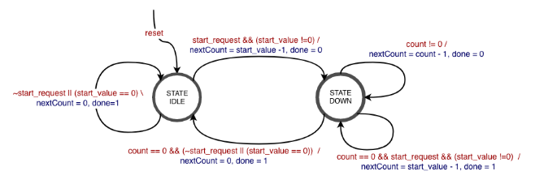

# Project 3: Timer

## Table of Contents
1. [Overview](#overview)
2. [Background](#background)
    - [Timers](#timers)
    - [State Machine Verilog Template](#state-machine-verilog-template)
    - [Testbenches for Sequential Logic](#testbenches-for-sequential-logic)
3. [Assignment Description] (#assignment-description)
    - [Timer](#timer)
    - [Auto-Reloading Countdown Timer](#auto-reloading-countdown-timer)
    - [Toggler](#toggler)
    - [Top-Level](#top-level)
    - [Testbenches](#testbenches)
    - [Constraints](#constraints)
4. [Evaluation]

### E210/B441, Spring 2021 Version 2021.

### Autograder Due: FIXME

### Demo Due: FIXME

## Overview <a name="overview"></a>

In this lab you practice designing simple state machines by implementing an auto-reloading
timer. This can be used to introduce fixed time delays into your circuits. You will then use this
timer to make an LED blink at various frequencies.

## Background <a name="background"></a>

### Timers <a name="timers"></a>

Timers are specialized clocks used for measuring
elapsed time. One example of a mechanical kitchen
timer is shown on the right.

In computers, a timer is a sequential logic element that
can delay for a given amount of time before doing
something. In this lab, we will be building a timer that
delays for a given number of clock cycles before
triggering, similarly to the delay and ding of a kitchen
timer.

To achieve this delay, we need to count the number of elapsed clock cycles. As the rising edge
of each clock cycle occurs, we update our total count by one until we reach the desired number
of clock cycles. As the Basys3 block runs at 80MHz, each clock cycle is 12.5 nanoseconds.
Therefore, a 1 millisecond delay requires 80,000 cycles.

12.5 ns / cycle * 80,000 cycles = 1 ms.

One can build timers that count down (like the kitchen timer) or count up (like a stopwatch).
We’re going to build a timer that counts up.

Let’s start with a simpler timer that can delay for 12 clock cycles. Let’s assume the timer has an
internal counter that starts at 4’h0. Then it increments each cycle until it hits 12 (4’hC). When
the timer’s count reaches 12 (4’hC), the timer “triggers”. For a kitchen timer the “trigger” would
be a ding. For our timer, that will be set an output signal to logical 1.

Just like your kitchen timer, most timers can be “reloaded” with a new value, and will begin
counting all over again. Some counters are even “auto-reloaded”. When these auto-reloaded
timers “trigger” they automatically restart the count.

### State Machine Verilog Template <a name="state-machine-verilog-template"></a>

Building state machines in Verilog requires **closely following a special form** , or template, that
we have demonstrated below. <b>Be warned: the tools do not enforce this template, it is up to you
to write your code correctly!</b>

Here is a simple state machine with one input, x, and two outputs, foo and bar. The outputs
are shown in red and the outputs are blue.


Notice that the outputs bar and foo are set differently. The value of <b>bar</b> can be assigned
based entirely on the current state (`STATE_ONE`), making it a Moore-type output. The value of
<b>foo</b> requires both state (`STATE_TWO`) and the input (<b>x</b>), making it a Mealy-type output.
A second interesting note is that two of the states, `STATE_IDLE` and `STATE_TWO`, have a
guard to control their state transitions. If x is `0` (shown as <b>!x</b>) the state remains unchanged. If
x is 1 (or just <b>x</b>), then the state transitions on the next clock edge. `STATE_ONE` does not have
a guard (shown as <b>-</b>). This means it always transitions to the next state on the clock edge.

The Verilog implementation of the state machine is provided below.

```verilog
module SimpleStateMachine(
    input clk, // clock signal
    input rst, // reset signal
    input logic x, // input signal
    output logic bar, // Moore-type output
    output logic foo // Mealy-type output
);
    //STATE NAMES
    // States can be named whatever you want.
    enum { STATE_IDLE, STATE_ONE, STATE_TWO } state, nextState;

    //sequential block, uses Flip-Flops
    // This always uses Non-Blocking (<=) assignments
    always_ff @(posedge clk) begin
        //reset is the only if() case we suggest in always_ff
        if (rst)
        state <= STATE_IDLE; //add a reset case
        else
        state <= nextState; //non-blocking
    end

    //combinational logic block
    //This always uses blocking (=) assignments
    //You need a default value for everything assigned
    // to avoid inferring a latch
    always_comb begin
        //defaults
        // Don’t forget these!
        // Otherwise you will end up with a latch
        nextState = state; //DO NOT FORGET DEFAULTS
        bar = 'h0; //DO NOT FORGET DEFAULTS
        foo = 'h0; //DO NOT FORGET DEFAULTS

        case(state)
        STATE_IDLE:
            //only transition to STATE_ONE if x is true
            if (x)
                nextState = STATE_ONE; //blocking
            else //optional, handed by default
                nextState = STATE_IDLE; //blocking
        STATE_ONE:
            nextState = STATE_TWO; //blocking
            bar = 'h1; //dependent on only state, not input
        STATE_TWO: begin
            if (x) begin
                nextState = STATE_IDLE; //blocking
                foo = 'h1; //dependent on state + input
            end else begin //optional
                nextState = STATE_TWO;
                foo = 'h0;
            end
        end
        default: nextState = STATE_IDLE; //case-default
        endcase
    end

endmodule
```

### Testbenches for Sequential Logic <a name="testbenches-for-sequential-logic"></a>

When constructing testbenches for sequential logic, you may find the `@(negedge clk)`
formulation helpful. This will execute the simulation <ins>until the next falling edge of the clock
signal</ins>. At this point, all the output signals should be stable, allowing you to test them without
having to know the exact `#delay` values necessary. With this you can skip forward a
considerable time in the simulation. An example testbench for the above state machine is given
below.

```verilog
`timescale 1ns / 1ps
module testbench;

    logic clk, rst, x;
    wire bar, foo;

    SimpleStateMachine ssm0(
        .clk,
        .rst,
        .x,
        .bar,
        .foo
    );


    task test_logic( input barT, fooT);
        #1 //let input changes settle
        assert( bar == barT) else $fatal("Bad bar");
        assert( foo == fooT) else $fatal("Bad foo");
    endtask

    //inverts the clock signal every 10ns
    always #10 clk = ~clk;

    initial begin
        // set initial values for clk and reset
        // Always start with rst = 1 for at least 1 clock cycle
        clk = 0;
        rst = 1;
        x = 0;

        $monitor ("clk:%b rst:%b x:%b foo:%b bar:%b", clk, rst, x, foo, bar);

        // wait until the negative (falling) edge of the clock
        // and clear reset
        @(negedge clk);

        $display(" transition to STATE_ONE");
        rst = 0;
        x = 1;
        test_logic ( 'h0, 'h0); //mealy-type test
        @(negedge clk);
        test_logic ( 'h1, 'h0); //moore-type test

        $display(" transition to STATE_TWO");
        x = 0;
        test_logic ( 'h1, 'h0); //mealy-type test
        @(negedge clk);
        test_logic ( 'h0, 'h0); //moore-type test

        $display(" stay at STATE_TWO");
        x = 0;
        test_logic ( 'h0, 'h0); //mealy-type test
        @(negedge clk);
        test_logic ( 'h0, 'h0); //moore-type test

        $display(" transition to STATE_IDLE");
        x = 1;
        test_logic ( 'h0, 'h1); //mealy-type test
        @(negedge clk);

        test_logic ( 'h0, 'h0); //moore-type test
        $display(" stay at STATE_IDLE");
        x = 0;
        test_logic ( 'h0, 'h0); //mealy-type test
        @(negedge clk);
        test_logic ( 'h0, 'h0); //moore-type test

        $display("@@@Passed\n");
        $finish;

    end
endmodule
```

## Assignment Description <a name="assignment-description"></a>

For this assignment, you will create a 25-bit auto-reloading timer.

### UPDATES STOPPED HERE

### Timer: <a name="timer"></a>

Your first task is to create a Verilog file named timer.sv with a module defined as follows:

```verilog
module timer(
    input clk,
    input rst,
    input start_request,
    input [24:0] start_value,
    output done
);
```

This module is the digital equivalent of the kitchen timer above. You set the time, start it, and let
it count.

As getting started with state machines can be quite complicated, we have provided <b>STARTER
CODE IN THE DOWNLOADS LINK ON THE WEBSITE!</b> Your task is to complete the
timer module to implement the following Mealy-type state machine. Red signals are
“guards”, blue signals are outputs.



The clock signal, `clk`, and the reset signal, `rst`, are inputs from a higher-level module.

Your counter should have two states, `IDLE` and `DOWN` (or `COUNTDOWN`). When in state `IDLE`,
the counter does nothing. done should be 1. If a `start_request` occurs in the `IDLE` state,
then the module should do the following things:
    1) Store the value of start_value into a 25-bit internal countdown register. This is handled by setting the value of nextCount, and then the always_ff block will set the value of count for you.
    2) Transition to the DOWNstate
    3) Set done to 0

In the `DOWN` state, done should be `0`. The module should also do the following:

    1) Decrement the internal countdown register by 1 each clock cycle. Again, this is done by setting the value of `nextCount`.
    2) If the value of count is 0, it should transition back to the `IDLE` state, and set done to 1

If a `start_request` occurs in the `DOWN` state, it can be ignored.

### Auto-Reloading Countdown Timer <a name="auto-reloading-countdown-timer"></a>

Your next task is to build a reloading timer. This is similar to the kitchen timer above, except it
auto-magically reloads itself every time it goes off.

Your next task is to create a Verilog file named `reloading_timer.v` with a module defined
as follows:

```verilog
module reloading_timer(
    input clk,
    input rst,
    input start_request,
    input [24:0] start_value,
    input stop,
    output trigger
);

    //
    // MORE CODE HERE!
    //

    logic reloadRequest; //can also be wire
    logic [24:0] reloadValue; // can also be wire
    logic [24:0] savedValue;
    logic [24:0] nextSavedValue;

    //
    // Declare a timer submodule
    // and connect the basics directly
    //
    timer tim0(
        .clk(clk),
        .rst(rst),
        .start_request(reloadRequest),
        .start_value(reloadValue),
        .done(trigger)
    );

    always_ff @(posedge clk) begin
        if (rst) begin
            //MORE CODE HERE!
            savedValue <= 25’h0;
            end else begin
            //MORE CODE HERE!
            savedValue <= nextSavedValue;
        end
    end

    //
    //MORE CODE HERE!
    //

endmodule
```

This module should instantiate a timer submodule, and automatically request a start
(`start_request == 1`) every time done is `1`. It must also keep a 25-bit value internally
(`savedValue`) that is used as the `start_value` of the timer. This internal value should
reset to `25’h0`, and is set when `start_request == 1`. The state machine for this module
is given below.


### Toggler <a name="toggler"></a>

Just as ‘hello world’ is one of the first things you do in programming, a blinking `LED` is one of the
first things you do with sequential logic. Therefore, we’re going to create a state machine to
blink an `LED`. How fast the `LED` blinks will be controlled by the reloading timer.

Your next task is to create a Verilog file named `toggler.v` with a module defined as follows:

```verilog
module toggler (
    input clk,
    input rst,
    input toggle_start,
    input [24:0] toggle_value,
    input toggle_stop,

    output logic toggle
);
```

This module should instantiate a `reloading_timer`. Every time the reloading timer’s
`trigger` output is high, you should flip the output of toggle. Just like the
`reloading_timer`, `toggle_start` starts the toggle sequence, and `toggle_stop` should
stop it.

For this module, you will get to create your own state machine. We recommend 3 states, `IDLE`,
`PING`, and `PONG`. Thus, then your machine is in `IDLE`, the toggler is stopped. Once started,
your state machine should bounce between `PING` and `PONG`. `PING` should output `toggle=0`,
`PONG` should output `toggle=1`. It should continue in those two states until a `toggle_stop`
request returns the machine to the `IDLE` state.

### Top-Level <a name="top-level"></a>

Your almost-final task is to create a Verilog file named `top.v` defined as follows. Luckily, we
decided the above modules were already enough work, and so we’re simply giving you this one.

```verilog
`timescale 1ns / 1ps

module top (
    input CLK100MHz,
    input btnC,

    input btnU,
    input btnD,
    input [15:0] sw,

    output [15:0] led
);
toggler tog0(
    .clk(CLK100MHz),
    .rst(btnC),
    .toggle_start(btnU),
    .toggle_value( {sw,9'h0} ),
    .toggle_stop(btnD),
    .toggle(led[0])
);

assign led[15:1] = 15'h0; //or other things

endmodule
```

This module instantiates a toggler submodule and routes the appropriate signals into/out of it.
Notice that we only have 16 switches, so to make the 25-bit `toggle_value`, we concatenate `9 0’s`
to the end of `sw` to make it a 25-bit number. We’re also only using `led[0]`, but you are welcome
to repurpose the remaining led’s for testing.

### Testbenches <a name="testbenches"></a>

For this project, you need to create two testbenches. <b>We provide a testbench for timer in the
downloads section.</b> You must create a testbench for `reloading_timer`, and one for
toggler. These should be titled `reloading_timer_tb.v` and `toggler_tb.v`.
Additionally, we recommend (but do not require) an additional top-level testbench, `top_tb.v`.

We encourage code reuse across these testbenches.

<ins>Remember to select “System Verilog” from the “File Type” drop-down menu.</ins>

### Constraints <a name="constraints"></a>

You will also need to reconfigure your constraints file to align with the top-level module
declaration. The names should line up properly by default. A reference file is available in the
Google Drive folder.

## Evaluation <a name="evaluation"></a>

The evaluation will have two steps, first submission of your source code and testbench to the
autograder. Second, you will need to synthesize your design, download it to the FPGA and do a
demonstration for the TA.

### Autograder (60%)

Log on to [Autograder](https://autograder.sice.indiana.edu) and submit your code as per Project 1.

### Demonstration (40%)

Program your FPGA with your demultiplexer and demonstrate your working system to the TA.
You will not receive full points until the TA has approved your demonstration.

<b>***Demonstration Note***: For the "on board" demonstration you should test inputs
higher than 4096, testing values lower causes the timer to expire and reload so quickly
that your eyes cannot perceive the LED blinking.</b>


