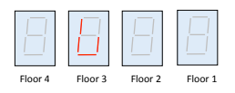
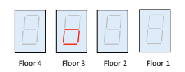
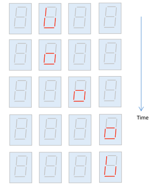

# Project 5: Elevator Control

## Table of Contents
1. [Overview](#overview)
2. [Background](#background)
    - [7-Segment Display](#sev-seg-display)
    - [Elevator Simulation](#elevator-simulation)
3. [Assignment Description](#assignment-description)
    - [Elevator Controller](#elevator-controller)
    - [7-Segment Display Driver](#sev-seg-display-driver)
    - [Slow Clock Driver](#slow-clock-driver)
    - [Top-Level](#top-level)
    - [Testbench](#testbench)
    - [Constraints](#constraints)
4. [Evaluation](#evaluation)

## Overview <a name="overview"></a> 

In this lab you will practice using state machines by designing and implementing a simulator of a
4-floor elevator system. You will also learn to use 7-segment displays.

## Background <a name="background"></a>

### 7-Segment Display <a name="sev-seg-display"></a>

An array of 7 LEDs is used to display decimal digits (0, 1, ... , 9) and alphabetical
characters (A, b, C, d, E, F, g, etc. ). The display works by illuminating appropriate
segments to create the letter or number. The combinations of segments which are illuminated to
display decimal digits are shown below.


For example the digit _1_ can be displayed by illuminating segments _B_ and _C_. The digit _5_
requires segments _A, F, G, C_ ,and _D_.

You can also use the 7-Segment display for non-ascii characters by simply setting the
appropriate segments. For this project, you will get to create an elevator with an open door by
setting segments _C, D, E_ , and _F_. You can create an elevator with a closed door by setting
segments _C, D, E_ , and _G_.

<b>A word of caution: the 7-segment drivers are <ins>active low logic</ins></b>, which means they interpret 0’s as
“True” or “On” and 1’s as “False” or “Off”. Please code your driver accordingly. Additionally,
<b><i>A-G</i> are encoded from right to left</b>, _ie GFEDCBA_. A is the LSB and G is the MSB. More
information about the 7-segment display can be found in the Basys3 Manual:

[Basys3 Manual](https://github.com/ENGR210/downloads/raw/master/Basys3_Manual.pdf)

### Elevator Simulation <a name="elevator-simulation"></a>

Suppose that a building with four floors has a freight elevator which is used to distribute
containers of, well let’s just say ‘beverages’. The elevator is initially loaded with enough
beverages for the day. A person calls the elevator to a floor by pressing a pushbutton which is
located next to the elevator door on that floor. When the elevator car arrives, the door opens
and someone takes out a container of beverages and leaves the elevator. The elevator stays at
the floor with the door open until another pushbutton is pressed on some other floor.
When the elevator is called from another floor, the door closes and the elevator leaves for the
floor from which it was called.

Door openings and closings take 1-3 seconds, and the elevator travelling between the floors
also takes 1 - 3 seconds.

You will simulate this freight elevator system by using the 7-segment displays on the Basys
board to visually represent the elevator car. Four 7-segment displays represent four floors, and
if the car is at floor _i_ ( _i_ = 1, 2, 3, 4), then the segments C, D and E of the _i_ ’th 7-segment display
are illuminated. In addition segment G is illuminated if the door is closed, and segment F is
illuminated if the door is open.

For example, the following diagram represents the four 7-segment displays which indicate that
the elevator is on **floor 3** and the **door is open**.



The next diagram shows the **door closed** but still on **floor 3**.



To illustrate the operation of the simulator, suppose that the elevator is on the third floor with the
door open, and it is called to the first floor. The following diagram shows snapshots of the
displays in time, each step takes about 1- 3 seconds.



Initially the elevator is on floor 3 with the door open (top figure). 1-3 seconds after being called,
the door closes (figure 2nd from the top), then the elevator travels down to floor 2 (figure 3rd
from the top). It arrives at floor 1 (figure 2nd from the bottom), and finally the doop opens
(bottom figure).

## Assignment Description <a name="assignment-description"></a>

Your assignment is to create the following Verilog modules and testbenches as specified below.

### Elevator Controller <a name="elevator-controller"></a>

Create a Verilog file named ElevCtrl.sv which defines a module as follows:

```verilog
module ElevCtrl(
    input clk, //clock
    input rst, //reset
    input [3:0] floorBtn,

    output logic [1:0] floorSel,
    output logic door
);
```

This module is responsible for creating the state machine necessary to control the elevator. It
takes in a clock and a reset generated from a higher-level module. It also takes in the raw floor
request buttons. You will need to design a state machine to drive both the next state and two
outputs. `floorSel` is an _encoding_ of the floor value, `2’h0` is the 1’st floor, `2’h1` is the `2nd`
floor, etc. door is a boolean signal which should be 1’h1 to indicate the elevator door is
currently open.

When `rst` (reset) is asserted, your controller should assume the elevator auto-magically
teleports to floor 1 (bottom floor) with the door open. <b>A button press should be remembered
until your elevator arrives at that floor and opens the door. Your state machine should respond
to whichever floor button pressed first, and ignore all additional button presses until the elevator
has opened its door. You do not need to worry about multiple buttons being pressed
simultaneously.</b>

### 7-Segment Display Driver <a name="sev-seg-display-driver"></a>

Create a Verilog file named `SevSegDisplay.sv` which defines a module as follows:

```verilog
module SevSegDisplay(
    input [1:0] floorSel,
    input door,
    output logic [6:0] segments,
    output logic [3:0] select
);
```

This module is responsible for correctly mapping the current floor and door position to the
7-segment display. `floorSel` is an encoding of the floor value, `2’h0` is the 1’st floor, `2’h1` is
the 2nd floor, etc. door is a boolean signal which should be `1’h1` to indicate the elevator door
is currently open. segments and select are the raw outputs that should be used to drive the
7-segment display. For example, `segment[0]` drives `LED` segment A. `select[0]` activates
the rightmost `LED`.

<b>Remember: the 7-segment display uses <ins>active low logic</ins>. See above for more details.</b>


### Slow Clock Driver <a name="slow-clock-driver"></a>

The slow clock module is used to create a low-frequency clock for simulations, ie the 1-
seconds clock.

<b>While necessary for correct timing in the Demo phase, it is un-usefully slow to simulate. When
you simulate with this module, we suggest you change slowClk = q[25] to slowClk =
q[4].</b>

```verilog
module SlowClk(
    input clk,
    output slowClk
);
    logic [25:0] q;

    //positive-edge triggered flip flop
    always_ff @(posedge clk)
        q <= q + 25’h1;

    assign slowClk = q[25]; //use q[4] for simulations

endmodule
```

### Top-Level <a name="top-level"></a>

Please use the following `top.sv`.

```verilog
`timescale 1ns / 1ps
module top(
    input CLK100MHZ,
    input btnC, // aka reset
    input btnL,
    input btnR,
    input btnU,
    input btnD,
    output logic [15:0] LED, //this is optional
    output logic [6:0] seg,
    output logic [3:0] an
);

    wire rst = btnC;
    wire slowClk;

    wire [1:0] floorSel;
    wire door;

    SlowClk sc0 (
        .clk(CLK100MHZ),
        .slowClk(slowClk)
    );

    ElevCtrl ec0(
        .clk(slowClk),
        .rst(rst),
        .floorBtn( { btnD, btnR, btnL, btnU} ),
        .floorSel(floorSel),
        .door(door)
    );

    SevSegDisplay ssd0(
        .floorSel(floorSel),
        .door(door),
        .segments(seg),
        .select(an)
    );

    //Debugging LEDs
    assign LED[0] = rst;
    assign LED[1] = 1'h0;
    assign LED[3:2] = floorSel;
    assign LED[4] = door;
    assign LED[15:5] = 'h0;

endmodule
```

### Testbench <a name="testbench"></a>

For this project, you need to create two testbenches. One testbench for `SevSegDisplay` and
one for `ElevCtrl`, called `SevSegDisplay_tb.sv` and `ElevCtrl_tb.sv` respectively.

<b>Remember that testbenches that simulate with an unmodified slowClk are un-usefully slow.</b>

### Constraints <a name="constraints"></a>

We recommend you copy the default constraints file from here:

[Basys3 Constraints](https://raw.githubusercontent.com/ENGR210/downloads/master/Basys3_Master.xdc)

You will also need to reconfigure your file to align with the top-level module declaration. The
names should line up properly by default.

## Evaluation <a name="evaluation"></a>

The evaluation will have two steps, first submission of your source code and testbench to the
autograder. Second, you will need to synthesize your design, download it to the FPGA and do a
demonstration for the TA.

### Autograder

Log on to [Autograder](https://ag.lukefahr.org/web/project/5) and submit your code as per Project 1.
