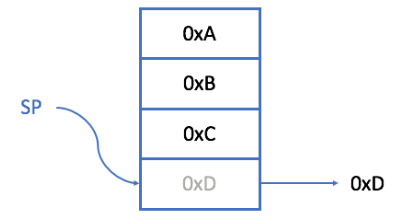
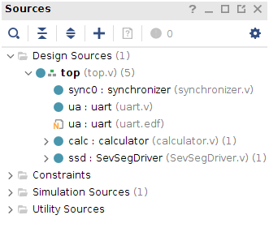

# Project 7: Postfix Calculator

## Table of Contents
1. [Overview](#overview)
2. [Background](#background)
    - [Postfix Calculators](#postfix-calculators)
    - [Stacks In Hardware](#stacks-in-hardware)
    - [Verilog Memory](#verilog-memory)
3. [Assignment Description](#assignment-description)
    - [UART (Old)](#uart-old)
    - [Synchronizer (Old)](#synchronizer-old)
    - [SevSegDriver (Optional)](#sevsegdriver-optional)
    - [Stack (New)](#stack-new)
    - [Calculator (New)](#calculator-new)
    - [Top (New)](#top-new)
    - [Testbench](#testbench)
    - [Constraints](#constraints)
4. [Python Helper Script](#python-helper-script)
5. [Evaluation](#evaluation)
6. [Appendix I: Reference UART](appendix-i-reference-uart)

### E210/B441, Spring 2020 Version 2020.

### Autograder Due: 11:59pm, Monday, April 27, 2020

### Demo Due: 11:59pm, Monday, April 27, 2020

## Overview <a name="overview"></a>

In this lab you will construct a postfix calculator which will receive commands and return values
over a UART interface.

## Background <a name="background"></a>

### Postfix Calculators <a name="postfix-calculators"></a>

Postfix notation, or Reverse polish notation, is a way of writing mathematical expressions where
each binary operator is preceded by the two operands it applies. Here are a few examples of
arithmetic expressions in traditional (or infix) and equivalent expressions in reverse Polish
notation.

| Infix expression | Postfix notation |
| ----------- | ----------- |
| 3 – 2 | 3 2 - | 
| (5 + 3 ) * 2 | 2 5 3 + * | 
| (12 - 3 ) /3 | 12 3 - 3 / | 

It is convenient to implement a processor for the postfix operations by using a stack. When
parsing a postfix expression, push incoming operands to the stack. In case of an arithmetic
operation, pop the two operands from the stack, compute the result of the arithmetic, and push
the result back onto the stack. In case of a unary operation, pop the top of the
stack and push the result back to the stack.

For example, assume the following expression in infix notation:

```
(5 + 3 ) * 2
```

To calculate the expression on infix processor, the expression has to be converted into postfix
notation:

```
2 5 3 + *
```

The following program instructs the postfix processor to evaluate the expression:

```
push 2 ;    //push 2 to the stack
push 5 ;    //push 5 to the stack
push 3 ;    //push 3 to the stack
     + ;    //pop two operands from the stack,
            //and push the sum to the stack
     * ;    //pop two operands from the stack,
            // and push the product to the stack
```

Here, it is important to understand that when you use an operator, you will have one less
operand and one less operator on your stack (since we require two operands for every
operation). In this case, after we use the ‘+’ operator, our stack is: [2 8 * ]. After we use the ' * '
operator, our stack is: [16].

#### Stacks in Hardware <a name="stacks-in-hardware"></a>

A stack is an abstract data type that stores elements in a Last-In-First-Out (LIFO) ordering. The
stack implements two operations, `PUSH(X)` and `POP()`. `PUSH(X)` adds the value `X` to the
stack, `POP()` returns the top value from the stack. Whereas most software implementations of
stacks allow the stack to grow to (near) arbitrary sizes, our hardware implementation will be
based on <b>a fixed-size memory array (M) and a Stack-Pointer (SP)</b>. The SP indicates where the
current head of the stack is, and is adjusted automatically each time a stack operation is carried
out.

Thus, the <b>PUSH(X)</b> operation is performed in two steps:
- Write the input data (X) to the memory location addressed by SP ( M[SP] ← X )
- Increment SP by 1 (SP ← SP + 1)
The POP() operation is performed in two steps:
- Return the data from the memory location addressed by the SP ( data ← M[SP] )
- Deciment SP by 1 (SP ← SP - 1)

As our stack is array based, the exceptions to the above rules are:
<b>1. If the stack (M) is full, PUSH(X) operations will fail.</b>
<b>2. If the stack (M) is empty, POP() operations will fail.</b>


For an example, assume we want to build a stack out of a 4-element array. Initially, our array is
empty, and the Stack-Pointer (`SP`) points to the zeroth (or top) element.


After a `PUSH(0xA)` operation is completed, the stack should look like this:


Again, after another `PUSH(0xB)` operation, the stack should look like this:


After two more push operations, `PUSH(0xC)`, `PUSH(0xD)`, your stack should look like this.
Notice that in this example `SP` has wrapped around back to index 0. <b>Although the exact value of
SP for this case does not matter, what does matter is that the stack tracks an internal full status,
here indicated by the FULL signal being true.</b>


Subsequent PUSH() operations will fail, as the stack cannot accept additional values.

If we call POP(), we get something like this, where the value 0xD is returned, and the SP
correctly points to the next “free” element. Notice, we do not need to physically remove the
value 0xD from the stack, but can overwrite it for subsequent PUSH() operations.



After we call `POP()`, `POP()`, `POP()`, we should be left with the following (empty) stack:


Subsequent calls to `POP()` will fail, as there are no new values to return. Finally, when a new
`PUSH(0xE)` is called, the stack will look as follows:


#### Verilog Memory <a name="verilog-memory"></a>

It is often useful to represent an array of 8-bit (1 byte) values in Verilog. This can be
represented as a 2D array of signals:

```verilog
reg [7:0] memory [0:127];
```

Thus, `memory[2]` will access the second (1 byte) value in the memory. `memory[2][3]` will
access the 3’rd bit in the 2nd byte of the memory array.

## Assignment Description <a name="assignment-description"></a>

Your assignment is to create the following Verilog modules and testbenches as specified below.

#### UART (Old) <a name="uart-old"></a>

Create a Verilog file named `uart.v` which defines a module as follows:

```verilog
module uart(
    input clk,
    input rst,
    input uart_rx_in,
    output uart_tx_out,
    input [7:0] tx_data,
    input tx_req,
    output tx_empty,
    output tx_err,

    output [7:0] rx_data,
    output rx_ready,
);
```

This module is unchanged from the previous project. We recommend you re-use your code or
take advantage of the code we have provided. If your UART design is non-functional, please
see Appendix I: Reference UART.

#### Synchronizer (Old) <a name="synchronizer-old"></a>

Create a Verilog file named synchronizer.v which defines a module as follows:

```verilog
module synchronizer (
    input clk, //your local clock
    input async, //unsynchronized signal
    output sync //synchronized signal
);

    // Create a signal buffer
    reg [1:0] buff;

    always @ (posedge clk) begin
        if (async) buff <= 2'b11;
        else buff <= {buff[0], 1'b0};
    end

    assign sync = buff[1];

endmodule
```

This module is unchanged from the previous project. We recommend you re-use your code or
take advantage of the code we have provided.

#### SevSegDriver (Optional) <a name="sevsegdriver-optional"></a>

Create a Verilog file named `SevSegDriver.v` which defines a module as follows:

```verilog
module SevSegDriver (
    input clk,
    input rst,
    input [7:0] byte0,
    input [7:0] byte1,
    output [6:0] seg,
    output [3:0] an
);
```

This module is unchanged from the previous project. We recommend you re-use your code or
take advantage of the code we have provided.

#### Stack (New) <a name="stack-new"></a>

This module declares a 128-entry stack of 8-bit (1 byte) elements. It should be defined as
follows:

NOTE: In addition to pop and push requests, your stack should also account for a simultaneous
pop and push. Think about it this way: It wouldn’t make sense to push something on, then
immediately pop it off. So what needs to happen?

```verilog
module stack(
    input clk,
    input rst,
    input push_req,
    input pop_req,
    input [7:0] data_in,
    output [7:0] TOS, //top of stack
    output TOS_valid,
    output push_err,
    output pop_err
);
```

NOTE: When should `push_err` and `pop_err` be raised? Hint: You’ve
already seen when. Also, `TOS_valid` means the TOS entry is valid. For
an empty stack, `TOS_valid` should be false. For a stack with 1 or
more elements, `TOS_valid` should be true. You can think of `TOS_valid`
as "!empty".

#### Calculator (New) <a name="calculator-new"></a>

This module defines a postfix calculator. This module should `instantiate a stack` internally.

```verilog
module calculator(
input clk,
input rst,


input [7:0] in_data,
input in_req,
output out_ready,
output [7:0] out_data,
output err
);
```

Upon rst, it will reset to a default state with a clear stack. It then accepts incoming byte
requests over `rx_data` (only valid when `rx_ready` is high). These bytes are interpreted as
follows
- `out_ready` indicates when your calculator is _ready_ to provide (“send out”) a value.
- err is a general error message.
- `in_req` is a request to input an operand or operator to the calculator.

<b>See the block diagram below to see how things connect to each other!</b>


If a `PEEK()` operation is called, the calculator should return a value over `UART`. It should set
`tx_data` correspondingly, and raise `tx_req` for 1 clock cycle. If `PUSH()` is called on a full
stack or `PEEK()` is called on an empty stack, it should raise `tx_err` for >=1 clock cycle to
indicate an invalid request.

#### Top (New) <a name="top-new"></a>

Your module should receive `UART` packets over the `RX` link, use the `UART` module to decode
them. It should then pass the decoded values into the Calculator module. Any calculator
responses should be passed to `UART` for transmission over the `TX` line. The `UART`’s `tx_err`
should be connected to `led[0]`. The calculator’s `err` should be connected to `led[1]`.
The use of the 7-Segment Displays and remaining `LEDs` is optional. A diagram is shown below.
clk and rst connections are not shown. Dashed blocks are optional.


To do this, create a Verilog file named top.v which defines a module as follows:

```verilog
module top(
    input clk,
    input btnC, //aka rst
    input RsRx, //aka uart_rx_in
    output RsTx, //aka uart_tx_out
    output [15:0] led, //only led[1:0] required
    output [6:0] seg, //optional
    output [3:0] an //optional
);

// DO NOT MODIFY
wire RsRx_sync;
synchronizer syncUartRx(
    .clk(clk),
    .async(RsRx),
    .sync(RsRx_sync)
);

//Your code here

endmodule
```

Hint: The `in_req` signal cannot be directly connected to the `rx_ready` signal of UART
because the `rx_ready` signal is high for 10400 clock cycles. That’s enough time to push many
values to your calculator stack. You will need to create a small state machine in top.v to set the
`in_req` signal high for just one clock cycle each time `rx_ready` goes high.

#### Testbench <a name="testbench"></a>

For this project, <b><ins>we do not require any testbenches for the autograder, since there are too many
combinations of different operands and operators. HOWEVER, you should still write your own
testbenches!</ins></b>

<ins>Remember to select “System Verilog” from the “File Type” drop-down menu.</ins>

#### Constraints <a name="constraints"></a>

You will also need to reconfigure your constraints file to align with the top-level module
declaration. The names should line up properly by default. A reference file is available in the
Google Drive folder.

## Python Helper Script <a name="python-helper-script"></a>


For testing and demonstration, use the python script below. This allows you to communicate
with the FPGA without having to convert between hex and ascii (the python script handles this)

[Calculator.py](../src/calculator.py)

To use the **calculator.py** to connect to your FPGA over UART, you need to specify the
correct USB device. On Linux, it looks something like this:

```shell
$ python3 calculator.py -s /dev/ttyUSB
```

## Evaluation <a name="evaluation"></a>

The evaluation will have two steps, first submission of your source code and testbench to the
autograder. Second, you will need to synthesize your design, download it to the FPGA and do a
demonstration for the TA.

#### Autograder (70%)

Log on to [Autograder](https://autograder.sice.indiana.edu) and submit your code as per `Project 1`.

#### Demonstration (30%)

Program your FPGA with your calculator and demonstrate your working system to the TA. You
will not receive full points until the TA has approved your demonstration.

## Appendix I: Reference UART <a name="appendix-i-reference-uart"></a>

If your `UART` module from Project 6 is not functioning correctly, we have provided a correct
reference implementation for you. You are allowed to utilize this `UART` for subsequent projects.

You will need to download both the files listed below:

[uart.edf](../src/uart.edf)

[uart.v](../src/uart.v)

`uart.edf` is a post-synthesis netlist of a `UART` design. `uart.v` is a “stub” that contains only the
uart module definition.

In Vivado, you will need to
- Create a project.
- Select “Add or Create Design Sources”.
- Now select both the uart.edf and uart.v files.
- (Optional, but recommended) Select the “Copy sources to project” checkbox.
- Select “Finish”


- Add other sources as normal.
- Instantiate a uart module as normal.
- Your “Sources” window should look like this.



- The remaining development, testing, and synthesis steps are unchanged.


