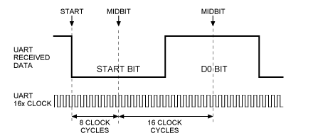
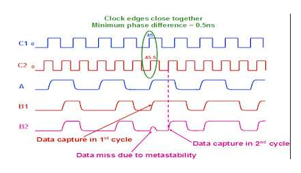
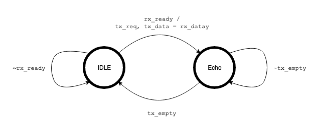
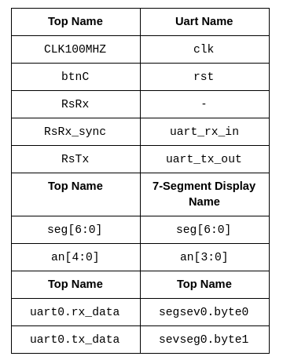

# Project 6: UART

## Table of Contents
1. [Overview](#overview)
2. [Background](#background)
    1. [UART](#uart-background)
    2. [Clock Domains](#clock-domains)
    3. [Connecting over UART with Screen](#connect-uart)
3. [Assignment Description](#assignment)
    1. [UART RX](#rx)
    2. [UART TX](#tx)
    3. [UART](#uart-assignment)
    4. [Seven Segment Driver](#sev-seg)
    5. [Top Module](#top)
    6. [Testbench](#testbench)
    7. [Constraints](#constraints)
4. [Evaluation](#evaluation)
5. [Resources](#resources)

## E210/B441, Spring 2020 Version 2020.

## Autograder Due: 11:59 PM Monday, April 13, 2020

## Demo Due: Submit bitstream and constraints on

## Canvas by 11:59 PM Monday, April 13, 2020.

## Overview <a name="overview"></a>

In this lab you will practice using state machines by designing and implementing a UART (or
RS232) interface.

## Background <a name="background"></a>

### UART <a name="uart-background"></a>

UART is short for “Universal Asynchronous Receiver / Transmitter”. It allows serial
communication between two devices. In our case we’re using it to communicate between the
Host machine and the FPGA. There are many different flavors of UART, but we will be using
the RS-232 standard.

Side note: We’re actually using RS-232 encoded over USB. Luckily, there is a chip on the
Basys3 board that is translating the USB into RS-232 for us.

UART (RS-232) has two wires, RX (receive) and TX (transmit). They are connected as follows,
where the TX of one device is the RX of another, and vice versa.


UART is composed of 1+8+1 bit “frames”. The transmitter keeps the TX wire high when not
transmitting. To transmit, the transmitter first pulls the TX wire low for one “bit” (called the start
bit ), followed by 8 data bits, followed by one high “bit” (called the stop bit ). This is shown below.


<b>Receiver:</b>
You know that data is coming when the line goes low. You discard the first start “bit”, then
capture 8 bits, then discard the last stop “bit”. The tricky part of UART is determining when the
next “bit” is on the wire. For our project, we’re using <b>9600 baud</b>, or 9600 bits-per-second. Bits
here includes the start and stop bits. Therefore, each bit should require roughly 9600Hz^-1 =
<b>104.166 us</b>. Trying to sample a bit at the beginning or end of it’s `104.16us` time window is
unreliable. A better approach is to sample at the middle of the time window or midbit. In our
case that’s `~52 us` from the beginning of the bit. This is illustrated below.



You will need to create a timer that uses the 100MHz Basys3 clock to trigger both a `104.16us`
and `52us` sampling times. When your uart module detects the RX line going low, it should wait
`52us` before sampling the start bit. It should then wait another `104.16us` before sampling the
first data bit (`D0`). It should continue to wait `104.16us` between sampling each bit. After 1+8+
bits, the `UART` packet is complete. You can throw away the start and stop bits, and are left with
an 8-bit value.

<b>Transmitter:</b>
You get to drive the data line here. When not transmitting, it should be high. To begin a
transmission, simply drive the data line low. Then wait `104us` (representing the passing of the
start bit), then drive it with `D0`. Then wait `104us` and drive it with `D1`, et cetera. To finish, drive it
high for `104us` (representing the passing of the stop bit).

### Clock Domains <a name="clock-domains"></a>

When crossing clock domains ( ie going between the desktop computer clock and the FPGA’s
clock) weird (bad) things can happen when the clocks don’t line up exactly. Data values can
become corrupted, entirely lost, or may reach some flip flops one clock cycle and others the
next cycle. This is illustrated below.



As such, it is important to synchronize your input signals, <i>ie</i> `UART’s RX` line. We recommend
using the following Verilog module to synchronize your input buffers:

```verilog
module synchronizer (
    input clk, //your local clock
    input async, //unsynchronized signal
    output sync //synchronized signal
);

    // Create a signal buffer
    reg [1:0] buff;

    always_ff @ (posedge clk) begin
        buff <= {buff[0], async};
    end

    assign sync = buff[1];

endmodule
```

An example of using the synchronizer module is shown below:

```verilog
// sync signals crossing clock domains
synchronizer syncUartRx(
    .clk(clk),
    .async(uart_rx),
    .sync(uart_rx_sync)
);
```

### Connecting over UART with Screen <a name="connect-uart"></a>

You can use the Unix program <b>screen</b> to connect to your FPGA over UART. You need to
specify the USB device that is encoding the RS-232 (see side note above). This is a little tricky.

On Linux, it looks something like this:


Note: You can also add the baudrate, 9600, as another optional argument. You can exit
screen with the following two-step key combination:

    1. ctrl + a (together)
    2. k

## Assignment Description <a name="assignment"></a>

Your assignment is to create the following Verilog modules and testbenches as specified below.

### UART_RX <a name="rx"></a>

Create a Verilog file named uart_rx.v which defines a module as follows:

```verilog
module uart_rx (
    input clk,
    input rst,
    input uart_rx_in,
    output [7:0] data,
    output ready //high for “stop” bit
);
```

`Clk` and `rst` are the standard clock and reset signals. `uart_rx_in` is the `RX` line into <i>your</i>
`UART` module (this is `TX` on the host machine).

The output ready tells the rest of the system that `uart_rx` has received a valid UART frame.
<b>The ready signal should be high (1) for the “stop” bit of the incoming UART transmission, and
low (0) all other times.</b> When ready is high, the `uart_rx` module will drive the data signal with
the received byte. When `ready` is `NOT` high, data is undefined.

### UART_TX <a name="tx"></a>

Create a Verilog file named uart_tx.v which defines a module as follows:

```verilog
module uart_tx (
    input clk,
    input rst,
    output uart_tx_out,
    input [7:0] data,
    input req, //request
    output empty, //able to accept new data
    output err //request error
);
```

`Clk` and `rst` are the standard clock and reset signals. `uart_tx_out` is `TX` line out of your
`UART` module (this is `RX` on the host machine). The data signal is ignored until `req` (or
request) is high. On the first positive clock edge that `req` is high, `uart_tx` should latch the data
into an internal register. It should then begin transmitting the `UART` frame of the latched data.
The latched data should be transmitted <b>least-significant bit (LSB) first, ie data[0] to data[7].</b>
After one cycle, the `req` line should be lowered. All subsequent changes to data should be
ignored until the next request.

The empty signal indicated that `uart_tx` is not currently transmitting a frame, ie “empty”, and is
ready to accept a new transmit request. This signal should go low when a transmit request is
made, and stay low until the completion of the entire transmission (including the stop bit). If a
new request is made while the module is transmitting a previous request, the err (error) signal
should be asserted to indicate the request will not be honored. <b>Note: make sure to time each
interval in your transmission frame for exactly 104.16us.</b>

### UART <a name="uart-assignment"></a>

Create a Verilog file named `uart.v` which defines a module as follows:

```verilog
module uart(
    input clk,
    input rst,
    input uart_rx_in,
    output uart_tx_out,
    input [7:0] tx_data,
    input tx_req,
    output tx_empty,
    output tx_err,
    output [7:0] rx_data,
    output rx_ready,
);
```

This module just connects the two uart submodules, `uart_tx` and `uart_rx`, into a single module.
The connections should map directly. <b>This module should only connect signals directly to the
corresponding submodule.</b>

### SevSegDriver <a name="sev-seg"></a>

Create a Verilog file named `SevSegDriver.v` which defines a module as follows:

```verilog
module SevSegDriver (
input clk,
input rst,
input [7:0] byte0,
input [7:0] byte1,
output reg[6:0] seg,
output reg[3:0] an
);
```

NOTE: You do <ins>not</ins> need to write this module yourself. <b>The code for this module is on Canvas.</b>

### Top <a name="top"></a>

Your module should receive `UART` packets over the `RX` link, and display the hex contents of the
received byte on the right-most two Seven-Segment Displays.


It should also echo the received byte back to the sender over the `TX` link. We suggest a state
machine that looks similar to the one shown below. Note: the signal names correspond to the
inputs and outputs of the uart module.



To do this, create a Verilog file named `top.v` which defines a module as follows:

```verilog
module top(
    input CLK100MHZ,
    input btnC, //aka rst
    input RsRx, //aka uart_rx_in
    output RsTx, //aka uart_tx_out
    output [15:0] led, //this is optional
    output [6:0] seg,
    output [3:0] an
);

// DO NOT MODIFY

wire RsRx_sync;
synchronizer syncUartRx(
    .clk(CLK100MHZ),
    .async(RsRx),
    .sync(RsRx_sync)
);

//@todo: create a UART
uart uart0 ( ... );

//@todo: create a 7-Seg Driver
SevSegDriver sevseg0 ( ... );

//@todo: Echo state machine

endmodule
```



NOTE: `uart0.rx_data` to `sevseg0.byte0` means to connect the output of the `rx_data`
signal of the `uart` module to the input of `byte0` for the 7-segment module.

### Testbench <a name="testbench"></a>

For this project, you need to create three testbenches. The first will test `uart_tx` and is named
`uart_tx_tb.v`. The second will test `uart_rx` and is named `uart_rx_tb.v`. The final
testbench is top_tb.v for the top-level module. We do not require a testbench for uart,
SevSegDriver, or synchronizer.

For testing, we recommend creating two UART modules, connecting the TX of one to the RX of
another, and using one to test the other.

Remember to select “System Verilog” from the “File Type” drop-down menu.

### Constraints <a name="constraints"></a>

You will also need to reconfigure your constraints file to align with the top-level module

declaration. The names should line up properly by default. A reference file is available in the

Google Drive folder.

## Evaluation <a name="evaluation"></a>

The evaluation will have two steps, first submission of your source code and testbench to the

autograder. Second, you will need to synthesize your design, download it to the FPGA and do a

demonstration for the TA.

### Autograder (60%)

Log on to https://autograder.sice.indiana.edu and submit your code as per Project 1.

### Demonstration (40%)

Program your FPGA with your UART and demonstrate your working system to the TA. You will

not receive full points until the TA has approved your demonstration.

Upload your bitstream to Canvas.

## Resources <a name="resources"></a>

https://www.maximintegrated.com/en/app-notes/index.mvp/id/

https://www.devobox.com/img/cms/04.jpg


