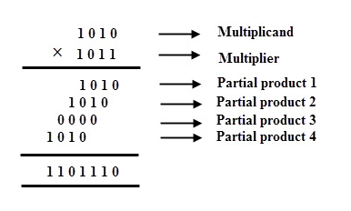
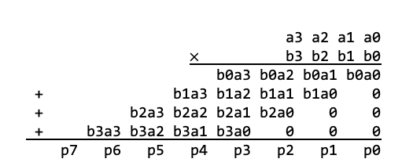
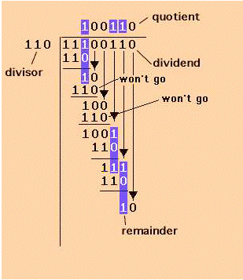
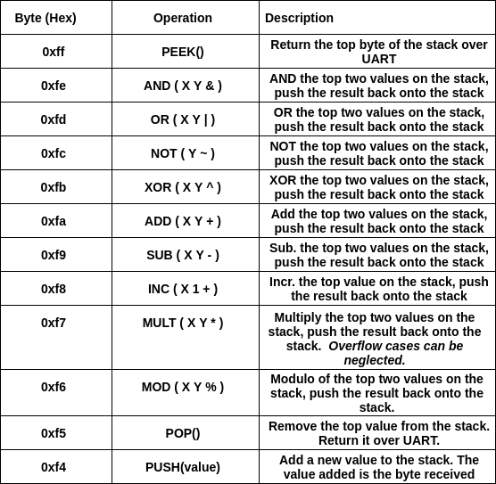

# Project 7b: Multiplier and Divider

## Table of Contents
1. [Overview](#overview)
2. [Background](#background)
    - [Binary Multiplication](#binary-multiplication)
    - [Binary Division](#binary-division)
3. [Assignment Description](#assignment-description)
    - [Multiplier (New)](#multiplier)
    - [Divider (New)](#divider)
    - [Calculator (Updated)](#calculator)
    - [Testbench](#testbench)
    - [Constraints](#constraints)
    - [Python Helper Script](#python-helper-script)
4. [Evaluation](#evaluation)
5. [References](#references)

### E210/B441, Spring 2019 Version 2019.

### Autograder Due: 11:15am, Friday, April 26, 2019

### Demo Due: 1:10pm, Friday, April 26, 2019

## Overview <a name="overview"></a>

This is a continuation of the P7: Calculator Project. Here we will add a multi-cycle multiplier to
the existing calculator. You can also optionally incorporate a multi-cycle divider for extra credit.

## Background <a name="background"></a>

### Binary Multiplication <a name="binary-multiplication"></a>

The basic process for binary multiplication consists of two steps, generating partial products and
then adding them. This is illustrated in the figure below [2].



Recall that the partial products can be generated as a series of simple boolean equations,
shown below.



There are a number of ways to add the partial products. Provided these implementations are
correct, we do not require a specific multiplier implementation. The only requirement is that
whatever multiplier implementation you choose, it must meet the timing requirements specified
below.

#### Binary Division <a name="binary-division"></a>

Below is the basic binary division algorithm illustrated graphically and with a brief algorithm for
implementation [1].



There are numerous techniques or algorithms to implement division, we recommend following
this simple algorithm:


- Set quotient to 0
- Align leftmost digits in dividend and divisor
- Repeat
    - If that portion of the dividend above the divisor is greater than or equal to the divisor
        - Then subtract divisor from that portion of the dividend and
        - Concatenate 1 to the right hand end of the quotient
        - Else concatenate 0 to the right hand end of the quotient
    - Shift the divisor one place right
- Until dividend is less than the divisor
- quotient is correct, dividend is remainder
- STOP

## Assignment Description <a name="assignment-description"></a>

Your assignment is to create the following new Verilog modules and testbenches as specified
below. You will then integrate them into the existing Calculator infrastructure.

#### Multiplier (New) <a name="multiplier"></a>

```verilog
module multiplier(
    input clk,
    input rst,
    input start,
    input [7:0] multiplicand,
    input [7:0] multiplier,
    output done,
    output [7:0] product
);
```

This module should compute the result of product = multiplicand * multiplier. The
operation is started when the start signal is raised. Upon a start request, your
implementation must take between 2-10 cycles to compute the product, and raise the done
signal when the result is complete. Done should stay high for 1 clock cycle.

You may assume that multiplicand and multiplier will not change during the
computation.

<b>This unit must synthesize correctly at the full 100MHz clock frequency of the Basys3 board.</b>
However, it may take multiple cycles to complete the operation.

<b>You may NOT use the built-in operator (' * ') for this module!</b>

Technically, the resulting product is actually 16 bits. However, our stack only stores 8-bit results.

<b>Therefore, the upper 8 product bits may be discarded.</b>

#### Divider (New) <a name="divider"></a>

NOTE: This module is optional. It is extra credit.

```verilog
module divider(
    input clk,
    input rst,
    input start,
    input [7:0] dividend,
    input [7:0] divisor,
    output done,
    output [7:0] quotient,
    output [7:0] remainder
);
```

This module should compute the result of `quotient = dividend / divisor` and `remainder =
dividend % divisor`. The operation is started when the start signal is raised. Upon a
start request, your implementation must take between 2-10 cycles to compute the `quotient`
and remainder, and raise the done signal when the result is complete. `Done` should stay
high for 1 clock cycle.

You may assume that `dividend` and `divisor` will not change during the computation.


<b>This unit must synthesize correctly at the full 100MHz clock frequency of the Basys3 board.</b>
However, it may take multiple cycles to complete the operation.

<b>You may NOT use the built-in operators (‘%’ or ‘/’) for this module!</b>

#### Calculator (Updated) <a name="calculator"></a>

This module defines a postfix calculator. It remains largely unchanged, with two exceptions.
First, two new operations must be supported, <b>multiplication and modulo</b>. Second, the calculator
should <b>instantiate multiplier and divider submodules</b> internally.

```verilog
module calculator(
    input clk,
    input rst,
    input [7:0] in_data,
    input in_req,
    output out_ready,
    output [7:0] out_data,
    output err
);

multiplier mult0 ( .clk(clk), .rst(rst), ... );

//extra credit
divider div0( .clk(clk), .rst(rst), ... );

endmodule
```



#### Testbench <a name="testbench"></a>

For this project, <ins>we do not require any testbenches for the autograder, since there are too many
combinations of different operands and operators. HOWEVER, you should still write your own
testbenches!</ins>

<ins>Remember to select “System Verilog” from the “File Type” drop-down menu.</ins>

#### Constraints <a name="constraints"></a>

You will also need to reconfigure your constraints file to align with the top-level module
declaration. The names should line up properly by default. A reference file is available in the
Google Drive folder.

#### Python Helper Script <a name="python-helper-script"></a>


For demonstration, use the python script available at the link below. This allows us to
communicate with the FPGA without having to convert between hex and ascii (the python script
handles this for us)

[Calculator.py](../src/calculator.py)

## Evaluation <a name="evaluation"></a>

The evaluation will have two steps, first submission of your source code and testbench to the
autograder. Second, you will need to synthesize your design, download it to the FPGA and do a
demonstration for the TA.

#### Autograder (60%)

Log on to [Autograder](https://autograder.sice.indiana.edu) and submit your code as per Project 1.

#### Demonstration (40%)

Program your FPGA with your calculator and demonstrate your working system to the TA. You
will not receive full points until the TA has approved your demonstration.

## References <a name="references"></a>

[1] https://courses.cs.vt.edu/~cs1104/BuildingBlocks/divide.030.html

[2] https://www.electronicshub.org/binary-multiplication/


